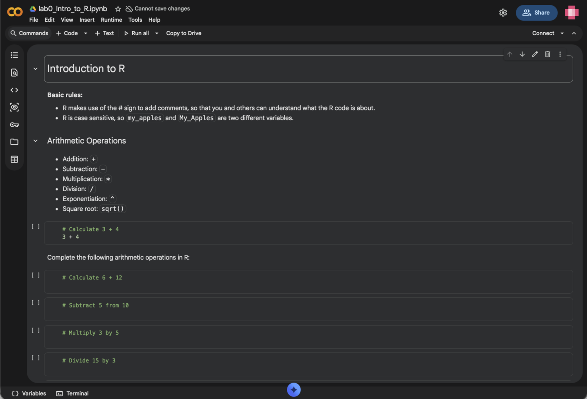
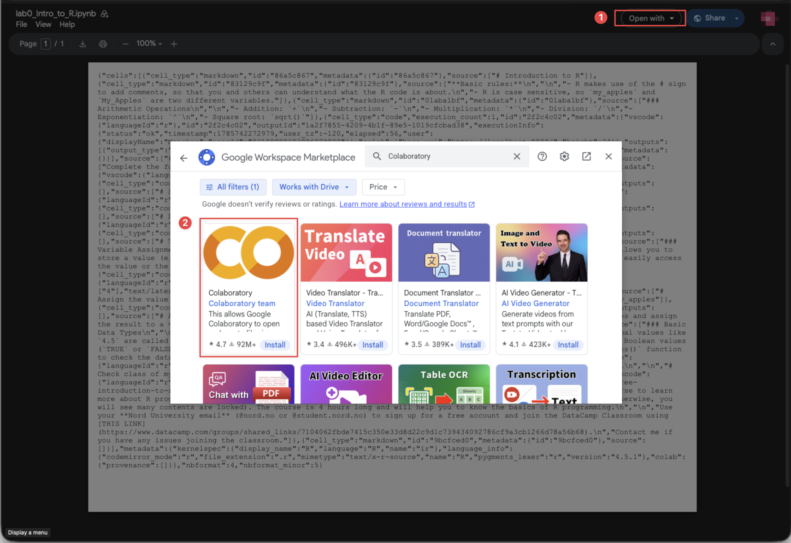

::: {.callout-note appearance="simple" icon=false}
This guide will help you set up your coding environment for FIN5005, with both cloud-based and local options available.

- **Cloud option:** [Google Colab with R Kernel](https://colab.research.google.com/) (Course Labs will be run in this)
- **Local option:** [RStudio Desktop](#RStudio-Desktop) (You will most likely use this for the home assignment)

Follow the instructions below to get started.
:::

## Cloud Solution

Cloud solution means that you don't need to install anything on your computer. You can run R code directly in your web browser. This is the easiest way to get started without worrying about installation issues. 

However, convenience comes at the cost of performance and control. Below is a comparison between cloud and local solutions. 

| Feature  | Cloud Solution  | Local Solution  |
| -------- | --------------- | --------------- |
| Compute power | 1 CPU core, 1 GB RAM | Depend on your computer |
| Performance   | Slower; up to the server | Faster; dependNon your computer |
| Environment control | Limited; when your session ends, your installed packages will be removed | Full control; environment is persistent across sessions; |
| Internet connection | Required | Not required |
| Storage | Limited; files need to be uploaded/downloaded | Files are stored directly on your computer |
| Best for | Learning, experimenting, and small projects | Regular coursework, larger datasets, and research projects |

--------------------------------------------------------------------------------

### Google Colab

1. **Create a new R-Notebook using the following link:** 

   [colab.research.google.com/notebook#create=true&language=r](https://colab.research.google.com/notebook#create=true&language=r)

   

2. **Type your first R code.**
   
   A notebook consists of cells, which can contain either code or text. Use the toolbar to add new cells.

   For example, type the following code in a code cell and click the play button to run it:

   ```r
   sessionInfo()
   ```

   The code output will show the R version and the packages currently loaded in your session.

   

   Congratulations! You have successfully set up your cloud-based R environment using Google Colab. You can now start coding and exploring R without any installation hassles.

**Further readings about Google Colab:**

- [Introduction to Google Colab Notebook](https://www.kaggle.com/code/ybifoundation/introduction-to-google-colab-notebook#Code-cells)
  
  This tutorial introduces how to upload/download data, sharing with others, adding text cells, and more.

--------------------------------------------------------------------------------

**FAQ**

Q: My environment is set to Python, how do I change it to R?  
A: Click on the "**Runtime**" in the menu bar > Select "**Change runtime type**" > Select "**R**" from the dropdown menu > Click "**Save**".


## Local Solution

### RStudio Desktop {#RStudio-Desktop}

[RStudio Desktop](https://posit.co/download/rstudio-desktop/) is a free and open-source integrated development environment (IDE) for R. It provides a user-friendly interface for writing and executing R code, making it easier to work with R scripts, data analysis, visualization.

To install RStudio Desktop, follow these steps:

1. **Install the R programming language**
   
   Download the R installer from the [CRAN website](https://cran.r-project.org). Choose the appropriate version for your operating system (Windows, macOS, or Linux) and follow the installation instructions.

   

2. **Install RStudio IDE**

   Go to [RStudio IDE Direct Download](https://docs.posit.co/ide/user/#direct-downloads-open-source) and download the installer for your operating system (Windows, macOS, or Linux).

3. **Check the installation is working**
   
   After installing both pieces of software, open RStudio to check the installation. It should start, and R should run in the Console window, listing the R version.

   


## AI Coding Assistant


**What AI coding assistant can do for you:**

  - **Code autocompletion**: generating suggestions while typing the code. 
  - **Code generation**: Copilot will use the context of the active document to generate suggestions for code that might be useful. 
  - **Answering questions**: it can also be used to ask simple questions while you are coding (e.g., "What is the definition of mean?"). 
  - **Language support**: supports multiple programming languages, including R, Python, SQL, HTML, and JavaScript.

--------------------------------------------------------------------------------

<i class="codicon codicon-lightbulb-sparkle env-green" aria-hidden="true" style="font-size:1.5em; vertical-align: middle;"></i> **How to use AI coding assistant in Google Colab and RStudio:**

- Google Colab has built-in support for **Gemini**.

- RStudio uses **GitHub Copilot** as the AI coding assistant. 
  
  **GitHub Copilot** is a powerful AI tool that offers autocomplete-style suggestions as you code. The tool can give you suggestions based on the code you want to use or by simply inquiring about what you want the code to do.

  It is developed by GitHub in partnership with OpenAI, and it is designated to best assist developers in writing code more efficiently.

  **To enable Copilot in RStudio**: click on Tools → Global Options → Copilot → tick the box saying "Enable GitHub Copilot" → sign in to your GitHub account, and there you go; you are ready to start!


## <span class="env-green"><i class="codicon codicon-rocket" style="font-size:2em; "></i> Exercise</span>

It is your turn to get started with R programming. 

Use [THIS LINK](https://drive.google.com/file/d/1LBVxO0rFgBTOnwSSERDL1aPShxppgSje/view?usp=sharing) to open the R Notebook in Google Colab. Follow the instructions in the notebook to complete the exercises.

The Notebook looks like the following:

```{r colab-1, echo=FALSE, out.width="100%"}

```

**Troubleshoot:** If the Notebook shows as raw code, click on the "**Open with**" button in the top right corner and select "**Colaboratory**" to open it in Google Colab.

```{r colab-2, echo=FALSE, out.width="100%"}

```
