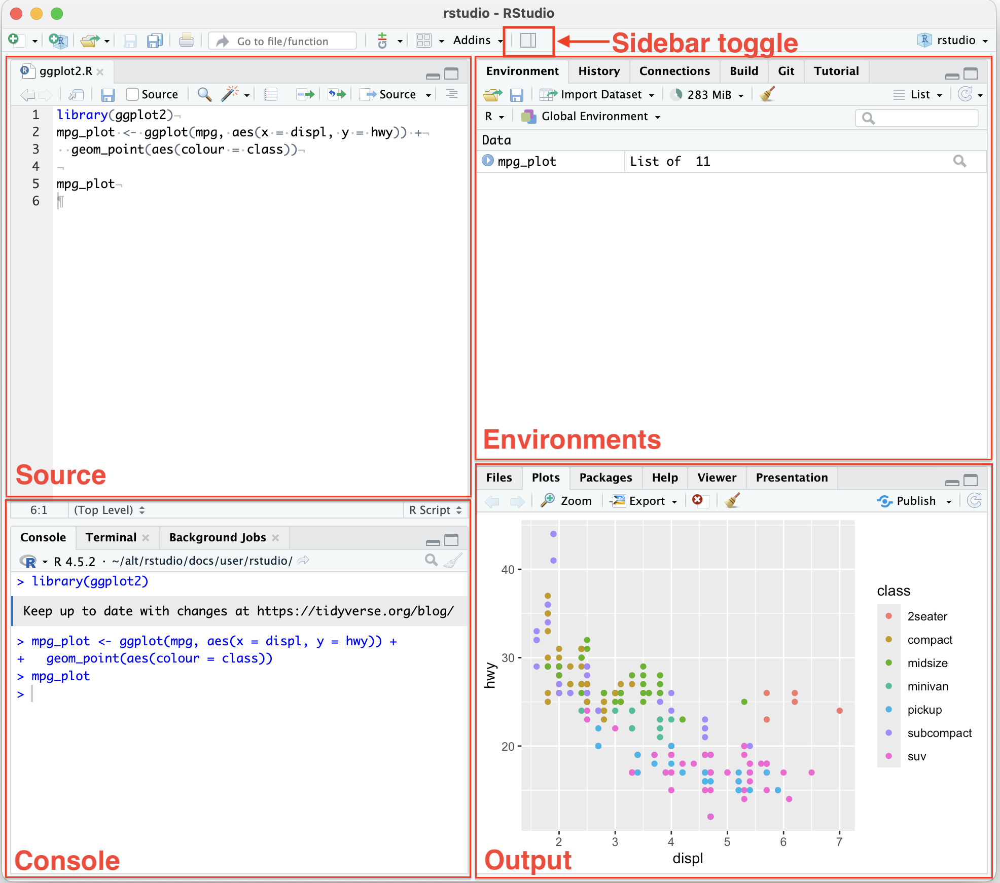
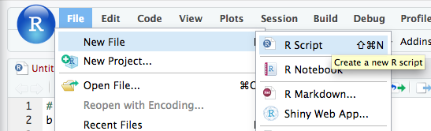
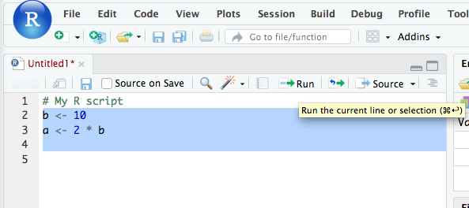
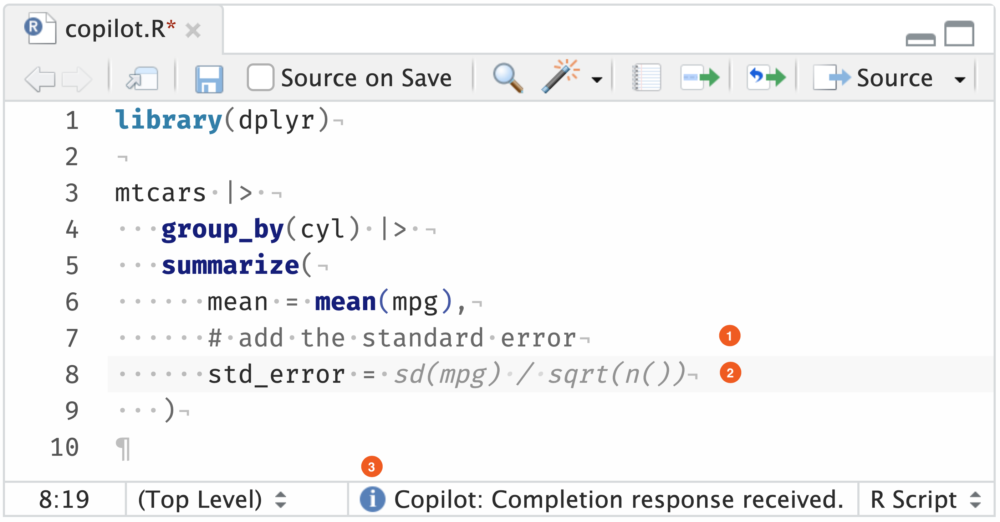

::: {.callout-note appearance="simple" icon=false}
This guide will help you set up your coding environment for FIN5005, with both cloud-based and local options available.

- **Cloud option:** [Google Colab with R Kernel](https://colab.research.google.com/) (Course Labs will be run in this)
- **Local option:** [RStudio Desktop](#RStudio-Desktop) (You will most likely use this for the home assignment)

At the end of the session, you will have two exercises to learn R basics using Google Colab  and RStudio desktop.

Follow the instructions below to get started.
:::

## Cloud Solution

Cloud solution means that you don't need to install anything on your computer. You can run R code directly in your web browser. This is the easiest way to get started without worrying about installation issues. 

However, convenience comes at the cost of performance and control. Below is a comparison between cloud and local solutions. 

| Feature  | Cloud Solution  | Local Solution  |
| -------- | --------------- | --------------- |
| Compute power | 1 CPU core, 1 GB RAM | Depend on your computer |
| Performance   | Slower; up to the server | Faster; dependNon your computer |
| Environment control | Limited; when your session ends, your installed packages will be removed | Full control; environment is persistent across sessions; |
| Internet connection | Required | Not required |
| Storage | Limited; files need to be uploaded/downloaded | Files are stored directly on your computer |
| Best for | Learning, experimenting, and small projects | Regular coursework, larger datasets, and research projects |

--------------------------------------------------------------------------------

### Google Colab `r if (knitr::is_html_output()) '' else '\\raisebox{-0.4em}{\\includegraphics[height=1.5em]{images/icon-google-colab.png}}'`

1. **Create a new R-Notebook using the following link:** 

   [colab.research.google.com/notebook#create=true&language=r](https://colab.research.google.com/notebook#create=true&language=r)

   

2. **Type your first R code.**
   
   A notebook consists of cells, which can contain either code or text. Use the toolbar to add new cells.

   For example, type the following code in a code cell and click the play button to run it:

   ```r
   sessionInfo()
   ```

   The code output will show the R version and the packages currently loaded in your session.

   

   Congratulations! You have successfully set up your cloud-based R environment using Google Colab. You can now start coding and exploring R without any installation hassles.

**Further readings about Google Colab:**

- [Introduction to Google Colab Notebook](https://www.kaggle.com/code/ybifoundation/introduction-to-google-colab-notebook#Code-cells)
  
  This tutorial introduces how to upload/download data, sharing with others, editing cells, and more.

--------------------------------------------------------------------------------

**FAQ**

Q: My environment is set to Python, how do I change it to R?  
A: Click on the "**Runtime**" in the menu bar > Select "**Change runtime type**" > Select "**R**" from the dropdown menu > Click "**Save**".


## Local Solution

### RStudio Desktop {#RStudio-Desktop}

[RStudio Desktop](https://posit.co/download/rstudio-desktop/) is a free and open-source integrated development environment (IDE) for R. It provides a user-friendly interface for writing and executing R code, making it easier to work with R scripts, data analysis, visualization.

To install RStudio Desktop, follow these steps:

1. **Install the R programming language**
   
   Download the R installer from the [CRAN website](https://cran.r-project.org). Choose the appropriate version for your operating system (Windows, macOS, or Linux) and follow the installation instructions.

   

2. **Install RStudio IDE**

   Go to [RStudio IDE Direct Download](https://docs.posit.co/ide/user/#direct-downloads-open-source) and download the installer for your operating system (Windows, macOS, or Linux).

3. **Check the installation is working**
   
   After installing both pieces of software, open RStudio to check the installation. It should start, and R should run in the Console window, listing the R version.

   


### RStudio User Interface

Read [THIS guide](https://docs.posit.co/ide/user/ide/guide/ui/ui-panes.html) to learn about the RStudio user interface.


```{r echo=FALSE, out.width='100%', fig.align='center'}

```

### Create and save a script

R scripts (`.R` or `.r` files) are text files that contain R code. 

Create and save a script in RStudio with:

1. Click on "**File**" → "**New File**" → "**R Script**".
   
   
2. Once the file has opened, Click on "**File**" → "**Save**".
3. Specify a name. The extension `.R` is automatically added.

You can now write R code in the script and run it in the Console window.



Select the code you want to run and click on the "**Run**" button in the toolbar, or use the keyboard shortcut `Ctrl + Enter` (Windows) or `Cmd + Enter` (Mac).


## AI Coding Assistant

**What AI coding assistant can do for you:**

  - **Code autocompletion**: generating suggestions while typing the code. 
  - **Code generation**: Copilot will use the context of the active document to generate suggestions for code that might be useful. 
  - **Answering questions**: it can also be used to ask simple questions while you are coding (e.g., "What is the definition of mean?"). 
  - **Language support**: supports multiple programming languages, including R, Python, SQL, HTML, and JavaScript.

--------------------------------------------------------------------------------

<i class="codicon codicon-lightbulb-sparkle env-green" aria-hidden="true" style="font-size:1.5em; vertical-align: middle;"></i> **How to use AI coding assistant in Google Colab and RStudio:**

- Google Colab has built-in support for **Gemini**.

- RStudio uses **GitHub Copilot** as the AI coding assistant. 
  
  **GitHub Copilot** is a powerful AI tool that offers autocomplete-style suggestions as you code. The tool can give you suggestions based on the code you want to use or by simply inquiring about what you want the code to do.

  It is developed by GitHub in partnership with OpenAI, and it is designated to best assist developers in writing code more efficiently.

  **To enable Copilot in RStudio**: click on Tools → Global Options → Copilot → tick the box saying "Enable GitHub Copilot" → sign in to your GitHub account, and there you go; you are ready to start!

  Copilot offers autocomplete-style suggestions as you code as “ghost text”. 

  Create a new R script in RStudio and type the following code in the script. As you type the comment `# add the standard error`, Copilot will show a suggestion, shown in light grey “ghost text”.

  ```{r echo=FALSE, out.width="100%"}
  
  ```
  
  **refs:**

  - [RStudio User Guide: GitHub Copilot Setup](https://docs.posit.co/ide/user/ide/guide/tools/copilot.html#setup): detailed instructions on how to set up GitHub Copilot in RStudio.
  - [RStudio User Guide: GitHub Copilot How to Use](https://docs.posit.co/ide/user/ide/guide/tools/copilot.html#using-copilot)


## <span class="env-green"><i class="codicon codicon-rocket" style="font-size:2em; "></i> Exercise</span>

Now it is your turn to get started with R programming. 

### Exercise 1: Work with R Notebook in Google Colab

Use [THIS LINK](https://colab.research.google.com/drive/1cpY6EGpNrqwIz-7ZITTQHZie3BPV-BpF?usp=sharing) to open the R Notebook in Google Colab. 

The Notebook looks like the following:

```{r colab-1, echo=FALSE, out.width="100%"}
knitr::include_graphics("images/Colab lab0.png")
```

Note: You only have View access to the notebook. To edit it, you need to make a copy of the notebook by clicking on "**File**" → "**Save a copy in Drive**". You can then edit the notebook in your own Google Drive.

Follow the instructions in the notebook to complete the exercises. You can download the notebook to your local computer by clicking on "**File**" → "**Download**" → "**Download .ipynb**". 

### Exercise 2: Work with R script in RStudio

Copy and paste the following code into a new R script in RStudio and complete the exercises. Save the script as `lab0.R`.

```r
# Instructions:
# - Work directly in this .R script.
# - For each task, write your R code below the instructions.
# - Run the code and copy the output in the console into the comments section below each task.

# ============================================================
# TASK 1: Create and use objects
# ============================================================
#
# 1. Create an object called `price` and give it the value 100.
# 2. Create an object called `quantity` and give it the value 5.
# 3. Create an object called `total` that calculates price * quantity.
# 4. Print `total`.
#
# Write your code below:


# Copy and paste the relevant Console output below.
# Output:


# ============================================================
# TASK 2: Work with vectors
# ============================================================
#
# A vector is a collection of values.
#
# 1. Create a vector called `prices` containing:
#    10, 15, 20, 25, 30
# 2. Calculate the mean of `prices`.
# 3. Find the minimum and maximum values.
# 4. Calculate the standard deviation.
#
# Write your code below:


# Copy and paste the relevant Console output below.
# Output:


# ============================================================
# TASK 3: Build a small portfolio data set
# ============================================================
#
# Your investment company is considering five companies:
#
# Company A
# Company B
# Company C
# Company D
# Company E
#
# The current share prices and annual returns are:
#
#             Price (NOK)     Return (%)
# Company A       20              5
# Company B       35             -2
# Company C       15              8
# Company D       50              3
# Company E       40              6
#
# 1. Create a data frame called `companies`.
# 2. Display the data frame.
# 3. Use `summary()` to get a summary of the data.
# 4. Use `str()` to inspect the structure of the data frame.
#
# Write your code below:


# Copy and paste the relevant Console output below.
# Output:


# ============================================================
# TASK 4: Identify the best and worst performers
# ============================================================
#
# The manager wants to know:
#
# "Which company had the highest return?"
# "Which company had the lowest return?"
#
# Using the `companies` data frame:
#
# 1. Find the highest return.
# 2. Find the lowest return.
# 3. Identify the company with the highest return.
# 4. Identify the company with the lowest return.
#
# Write your code below:


# Copy and paste the relevant Console output below.
# Output:


# ============================================================
# TASK 5: Visualise the companies
# ============================================================
#
# A picture can make it easier to compare companies.
#
# Create a scatter plot with:
#
#     x-axis = Share price
#     y-axis = Annual return
#
# 1. Create the scatter plot using `plot()`.
# 2. Add a meaningful x-axis label.
# 3. Add a meaningful y-axis label.
# 4. Add a meaningful title.
#
# Write your code below:


# Copy and paste the relevant Console output below.
# Output:


# After looking at the plot, answer:
#
# Do companies with higher share prices appear to have higher
# returns in this small sample?
#
# Your answer:
#
#
```