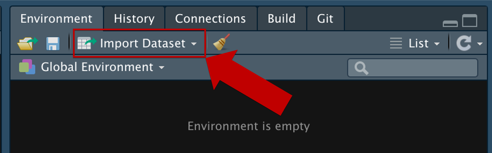
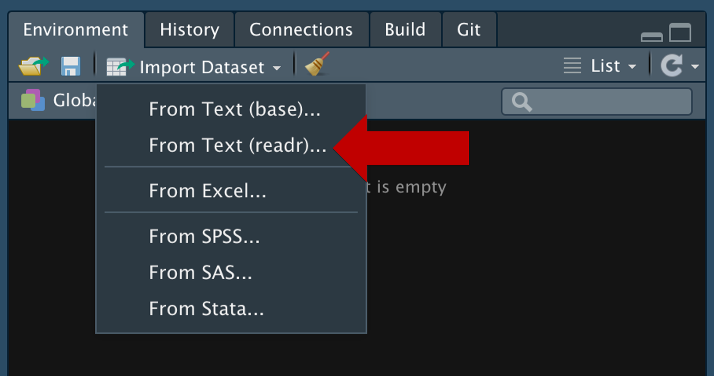
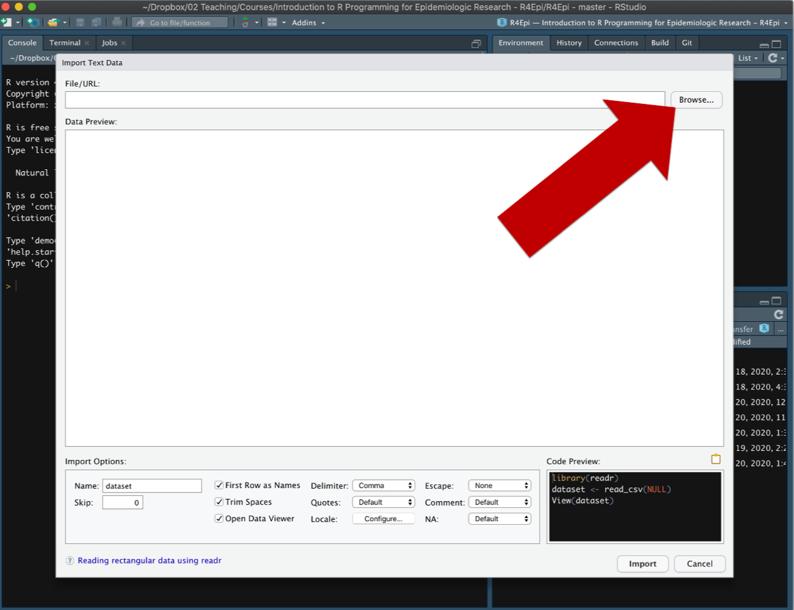
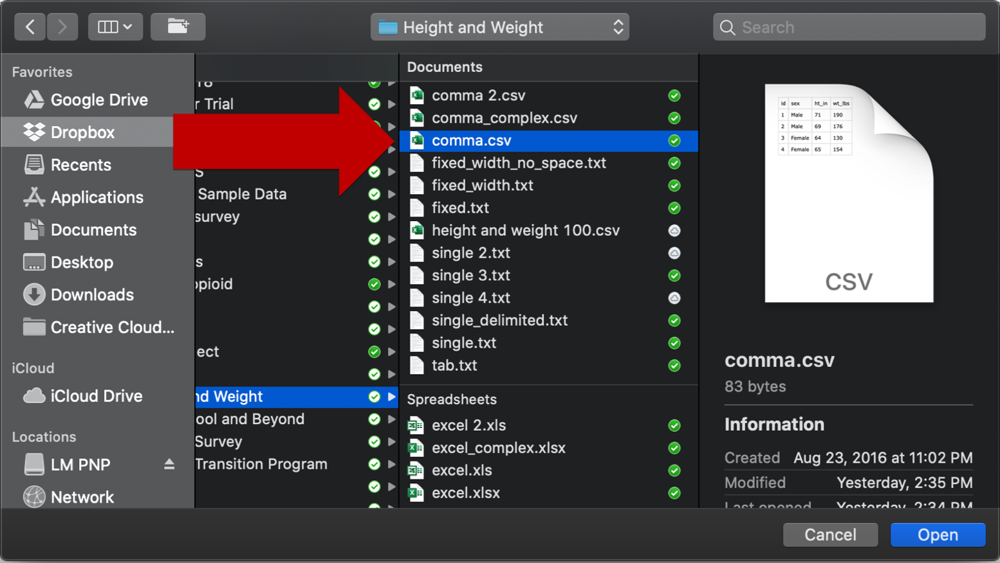
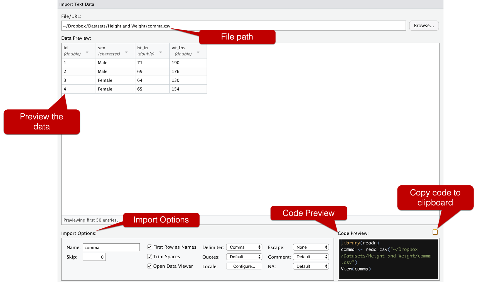
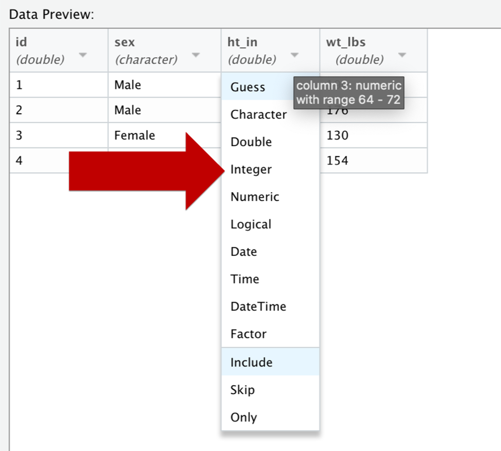
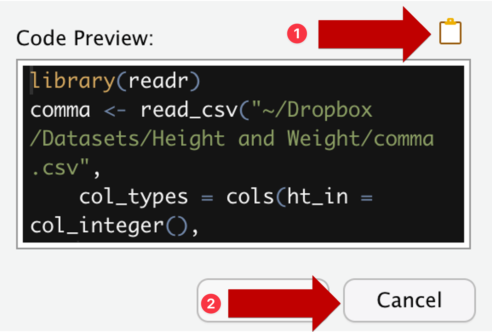

::: {.callout-note appearance="simple" icon=false}
🎯 In this session, you will lean how to import data from local files.

In business analytics, when you have a dataset and you want to analyze it in R. The first step is to import the data into R. 
You can use the command `read.csv()`, but you need to specify the correct path to your data file. This can be tricky if you are not familiar with file paths and directories.

An easier alternative is to use RStudio's **Import Dataset** tool, which provides a graphical interface to select your data file and automatically generates the code to import it. This is especially useful for those who are new to R or prefer a visual approach.

Up to now you have loaded data by writing `read_csv()` yourself. RStudio also ships with a point-and-click **Import Dataset** tool that writes that line of code for you.

We will use a small example dataset to illustrate the process. The dataset is a CSV file with four rows of heights and weights. You may click [HERE](data/comma.csv) to download this file to your compter.
:::

`comma.csv` data preview:

It contains four rows of heights and weights.

|   id | sex    | ht_in | wt_lbs |
| ---: | :----- | ----: | -----: |
|    1 | Male   |    71 |    190 |
|    2 | Male   |    69 |    176 |
|    3 | Female |    64 |    130 |
|    4 | Female |    65 |    154 |


## Environment setup

The "**From Text (readr)**" option uses the `readr` package, so `readr` has to be installed.

**If you already have the `tidyverse`, you are done.** `readr` is one of the core tidyverse packages, so installing `tidyverse` installed `readr` along with it — there is nothing extra to do. That is the case if you followed [Environment Setup](00_environment_setup.qmd).

Otherwise, run in the RStudio **Console**:

```r
install.packages("readr")
```

## Import a CSV step by step

1. In the **Environment** pane, click "**Import Dataset**".

   

2. Choose "**From Text (readr)**".

   

   The two text options differ in which code they write for you. "**From Text (readr)**" uses `read_csv()` from the `readr` package (part of the `tidyverse`), and "**From Text (base)**" uses base R's `read.csv()`. This course uses `readr` throughout, so pick that one.

3. The **Import Text Data** window opens. Click "**Browse...**" to find your file.

   

4. Your operating system's file explorer opens. Select the file you want — here, `comma.csv`.

   

5. The window now fills in. Four areas are worth reading before you do anything else.

   

   - **File/URL** — the path to the file you picked.
   - **Data Preview** — how R is *currently* parsing the file, with the type R has guessed under each column name. Check this: if a column you expect to be numeric shows up as `character`, something in the file is not what you think it is.
   - **Import Options** — the name the object will get, whether the first row holds the column names, the delimiter, how missing values are written, and so on.
   - **Code Preview** — the code that produces exactly the import you have configured. Every change you make above rewrites this box.

6. **Optional: You can change a column type** by clicking the small arrow in its column header and choosing from the dropdown. Here `ht_in` and `wt_lbs` are being changed from `double` to `integer`, since heights and weights in this file are whole numbers.

   

   The same menu has `Factor`, `Date` and `Skip`, which saves you a separate cleaning step later. Watch the **Code Preview** box as you do this: a `col_types` argument appears.

7. **Important step: Do <span class="env-orange">NOT</span> press the "Import" button.** Click the clipboard icon above the **Code Preview** box to copy the code, then press "**Cancel**". This makes your import reproducible. You can re-run the same code again later.
   
   ::: {.callout-caution appearance="simple"}
   ## Why copy the code instead of clicking Import?
   
   If you click "**Import**", RStudio will load the data for your current session only. 
   If you want to import the data again, you will have to go through the import dialog again. This is <span class="env-orange">**NOT** reproducible</span>, and hence not a good practice.
   :::

   

8. **Final Step:** Go back to your R script or Quarto document and paste. Run the pasted code as though you had typed it yourself.

## The code you end up with

Pasting gives you something close to this:

```r
library(readr)
comma <- read_csv(
    "~/Dropbox/Datasets/Height and Weight/comma.csv",
    col_types = cols(ht_in = col_integer(),
                     wt_lbs = col_integer())
    )
View(comma)
```

Note:

- **Path** will be specific to your computer and your file location. 
- **Drop `View(comma)`.** It opens the data viewer, which is handy once but does nothing useful inside a script or a rendered document.

That leaves:

```{r import-comma, echo=FALSE}
library(readr)
comma <- read_csv(
    "data/comma.csv",
    col_types = cols(ht_in = col_integer(),
                     wt_lbs = col_integer())
    )
comma
```

```{r eval=FALSE}
library(readr)
comma <- read_csv(
    "~/Dropbox/Datasets/Height and Weight/comma.csv",
    col_types = cols(ht_in = col_integer(),
                     wt_lbs = col_integer())
    )
comma
```

Note what `col_types` bought us: `ht_in` and `wt_lbs` come in as `<int>` rather than `<dbl>`, exactly as chosen in the dialog.


## Exercise

Use the "**Import Dataset**" tool to load `CASchools_test_score.csv`, the dataset used later in the course.
Download it from [HERE](data/CASchools_test_score.csv).

1. Open the file through **Import Dataset** → **From Text (readr)**.
2. In the **Data Preview**, set `county` and `grades` to type `Factor`.
3. Copy the code, cancel the dialog, and paste it into a script.
4. Run `str()` on the result and check that `county` and `grades` are factors.

---

**Further readings:**

- [@Brad Cannell, RStudio's Data Import Tool](https://www.r4epi.com/chapters/rstudio_import_tool/rstudio_import_tool)
- [RSutdio User Guide: Local Data](https://docs.posit.co/ide/user/ide/guide/data/data-local.html)
  
  You may find "**Importing data from Excel files**" in this guide.
