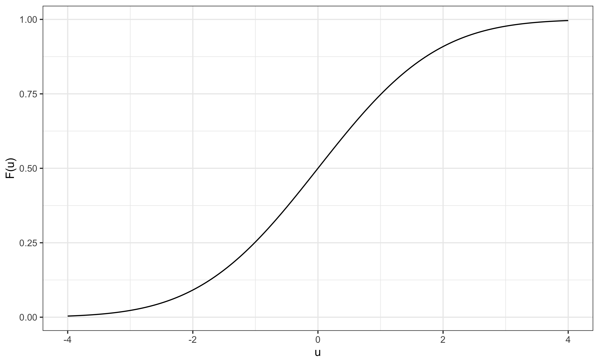

<SCRIPT language="JavaScript" SRC="my_jxscript.js"></SCRIPT>

<a class="top-link" href="#top" id="js-top">↑</a>

```{r setup, include=F, echo=F}
library(knitr) # load packages
library(kableExtra)
library(tidyverse)
library(latex2exp)
library(stargazer)
library(bookdown)
library(cowplot)
library(scales)

# don't show code unless we explicitly set echo = TRUE
opts_chunk$set(echo = TRUE, message=FALSE, warning = FALSE, fig.align="center", fig.pos = "H", paged.print=FALSE)
opts <- options(knitr.kable.NA = "")

## control long outputs by using eg `max.lines = 10`
hook_output_default <- knitr::knit_hooks$get('output')
truncate_to_lines <- function(x, n) {
   if (!is.null(n)) {
      x = unlist(stringr::str_split(x, '\n'))
      if (length(x) > n) {
         # truncate the output
         x = c(head(x, n), '...\n')
      }
      x = paste(x, collapse = '\n') # paste first n lines together
   }
   x
}
knitr::knit_hooks$set(output = function(x, options) {
   max.lines <- options$max.lines
   x <- truncate_to_lines(x, max.lines)
   hook_output_default(x, options)
})
plot_png <- function(p, f_name, width, height, ppi=300){
    # a plot wrapper
    png(f_name, width=width*ppi, height=height*ppi, res=ppi)
    print (p)
    dev.off()
}
```


A limited dependent variable (LDV) $y$ takes values in some “limited” set. Examples:

- Binary: $y\in \{0,1\}$
- Integer: $y\in \{0,1,2, \ldots\}$
- Censored: $y\in \mathbb R^+$


We will focus on the binary dependent variable case for our course.

# Introductory Example

The western collaborative group study (WCGS) was a large epidemiological study designed to investigate the risk factors and coronary heart disease (CHD).
More than 3000 men were recruited to the study, and a number of (potential) risk factors were recorded at entry. The men were then followed for about ten years and it was recorded if they developed CHD or not. 

In this introductory example, we will study the effect of smoking and age on the risk for CHD.

```{r paged.print=TRUE}
wcgs <- read.table("https://raw.githubusercontent.com/my1396/course_dataset/refs/heads/main/wcgs.txt",
                   sep="\t", header=T, na.strings=".")
wcgs %>% head(20)
```

```{r}
wcgs %>% select(chd69, age) %>% str()
```

We first look at the effect of smoking (predictor) on CHD (outcome).

- `smoke` is a binary covariate taking values either 0 (`non-smoker`) or 1 (`smoker`). 

- `chd69` is a binary covariate indicating whether a person developed CHD, 0 for `non-developed` and 1 for `developed.`


A <span style='color:#337ab7'>**contingency table**</span> is an effective method to see the association between two categorical variables. It counts the number of observations in each of the four possible scenarios.
When dealing with just one categorical variable, this is referred to as a **frequency table**, which count the number of observations for each category.


We start out by making a 2x2 contingency table for the development of CHD or not for smokers and nonsmokers:

```{r}
contingency_data <- wcgs %>% 
    select(smoke, chd69) %>% 
    mutate(smoke = factor(smoke, levels=c(0,1), labels=c("non-smoker","smoker")),
           chd69 = factor(chd69, levels=c(0,1), labels=c("non-developed", "developed")))
contingency_table <- with(contingency_data, table(chd69, smoke))
contingency_table
```

We can display row and column totals if needed.
```{r}
contingency_table %>% addmargins()
```

- We see that there are 1502 smokers and that 159 of these developed CHD.
- Of the 1652 non-smokers, 98 developed CHD.


The <span style='color:#337ab7'>mosaic plot</span> represents each combination of the variables as a rectangle, and the size of the rectangle is proportional to the number of individuals in that combination.

```{r}
mosaicplot(contingency_table %>% t(), 
           xlab="Smoke", ylab="CHD", 
           main="Contingency table visualization: Smoke X CHD")
```

We could see a larger proportion of people that developed CHD for smokers compared to non-smokers.

We can show the proportions based on rows (developed vs. non-developed) .
```{r}
contingency_table %>% 
    prop.table(margin=1)
```

- For people who developed CHD, $61.9\%$ smoke.
- For people who did not develop CHD, $46.4\%$ smoke.


We can show the proportions based on columns (smokers vs. non-smokers) in Table \@ref(tab:risk-table).

```{r}
risk_table <- contingency_table %>% 
            prop.table(margin=2) %>% 
            as.data.frame.matrix() 
```


```{r risk-table, echo=FALSE}
risk_table %>% 
    as_tibble(rownames = " ") %>% 
    add_column("  " = c("CHD", NA), .before=1) %>% 
    mutate_at(vars(-1:-2), percent, accuracy=0.01) %>% 
    kable(align = "clcc", caption="Risk of developing CHD for non-smokers and smokers.") %>% 
    kable_styling(bootstrap_options = c("striped", "hover"), full_width = F) %>% 
    add_header_above(c(" "=2, "Smoke"=2)) %>% 
    column_spec(1:2, bold = TRUE) 
```


- For non-smokers, $5.9\%$ developed CHD.
- For smokers, $10.6\%$ developed CHD.

___

## Measure or Risk and Association for Binary Outcomes

- The *risk* refers to outcome risk for individuals who are smokers or non-smokers and are simply the observed proportions of individuals with CHD in these groups.

    - In our case, the risk for non-smokers is the proportion who developed CHD among non-smokers, which is $5.9\%$.
    - The risk for smokers is the proportion who developed CHD among smokers, which is $10.6\%$.
    
- The <span style='color:#008B45FF'>*risk difference*</span> or <span style='color:#008B45FF'>*excess risk*</span> (ER) is defined as the difference between the estimated risk in the groups defined by the predictor. 
    - For our contingency table, we can see that the risk difference is
        $$
        10.6\%-5.9\%=4.7\%
        $$
        
        Can be verified as:
        ```{r}
        p1 <- risk_table[2,2]
        p0 <- risk_table[2,1]
        p1-p0
        ```
    
- The <span style='color:#008B45FF'>*risk ratio*</span> or <span style='color:#008B45FF'>*relative risk*</span> (RR) is the ratio of these risks. 
    - In our example, the risk ratio is
        $$
        \frac{10.6\%}{5.9\%}=1.8
        $$
        
        Can be verified as
        ```{r}
        RR <-  p1/p0
        RR
        ```
    
    
- The <span style='color:#008B45FF'>**odds ratio**</span> (OR) is the ratio between the corresponding odds in the two groups.
    - The <span style='color:#008B45FF'>**odds**</span> of an outcome occurring are computed as the probability of *occurrence* divided by the complementary probability that the event does *not occur*. 
    
        Given a probability $p$, the odds is given by
        
        $$
        \text{odds} = \frac{p}{1-p}
        $$
        
        Since the denominators of these two probabilities are identical, the odds can be also be calculated as the ratio of the number of outcomes to nonoutcomes. 
        
        For example, getting heads with a fair coin has *even odds*, that is, the probability of getting a head is $50\%$.
    
    - The odds of CHD occurrence in the smokers groups are 
        $$
        \frac{10.6\%}{1-10.6\%} = 11.84\%
        $$
        
        Can be verified as
        ```{r}
        p1/(1-p1)
        ```
        
    - The odds of CHD occurrence in the non-smokers groups are 
        $$
        \frac{5.9\%}{1-5.9\%} = 6.31\%
        $$
        
        Can be verified as
        ```{r}
        p0/(1-p0)
        ```
    
    - The odds ratio is the ratio between the corresponding odds in the two groups, which is given by
    
        $$
        \frac{11.84\%}{6.31\%} = 1.88
        $$
        
        Can be verified as
        ```{r}
        OR <- (p1/(1-p1))/(p0/(1-p0))
        OR
        ```
        
___

From a fitted logistic model we may estimate the odds ratio corresponding to a one unit's increase in a covariate. Use this result to compute the odds ratio for CHD for a smoker compared to a non-smoker.

## Logistic Regression with a Single Predictor

We then use a logistic regression model with smoke as covariate.

```{r}
fit.smoke <- glm(chd69~smoke, data=wcgs, family=binomial)
```


```{r fit-smoke, echo=FALSE, results='asis', fig.cap="Logistic regression of CHD on smoke."}
tit <- knitr::opts_current$get("fig.cap")
tit_html <- paste0('<span id="tab:',
                   knitr::opts_current$get("label"),
                   '">(#tab:',
                   knitr::opts_current$get("label"),
                   ')</span>',
                   tit)
stargazer(fit.smoke, type="html",
          label = paste0("tab:", knitr::opts_current$get("label")),
          title = ifelse(knitr::is_latex_output(), tit, tit_html),
          notes="<span>&#42;</span>: p<0.1; <span>&#42;&#42;</span>: <strong>p<0.05</strong>; <span>&#42;&#42;&#42;</span>: p<0.01 <br> Standard errors in the parentheses.",
          notes.append=F )
```

In logistic regression, if we <span style='color:#337ab7'>take the exponential of the coefficient</span>, it is the <span style='color:#337ab7'>odds ratio corresponding to one unit's increase in the value of the covariate</span>, holding other variables constant.

In this case, the odds ratio for CHD for a smoker compared to a non-smoker can be obtained by

$$
e^{0.63} = 1.88\, ,
$$
which is exactly the same number as we calculated using the contingency table.


We now consider a numerical predictor, `age`.
We then use logistic regression to study the effect of age for the risk of developing CHD:

```{r}
fit.age <-  glm(chd69~age, data=wcgs, family=binomial)
```


```{r fit-age, echo=FALSE, results='asis', fig.cap="Logistic regression of CHD on age."}
# Use title caption from fig.cap
tit <- knitr::opts_current$get("fig.cap")
# Adding caption for html output
tit_html <- paste0('<span id="tab:',
                   knitr::opts_current$get("label"),
                   '">(#tab:',
                   knitr::opts_current$get("label"),
                   ')</span>',
                   tit)
stargazer::stargazer(fit.age,
          label = paste0("tab:", knitr::opts_current$get("label")),
          title = ifelse(knitr::is_latex_output(), tit, tit_html),
          type = ifelse(knitr::is_latex_output(),"latex","html"),
          notes = "<span>&#42;</span>: p<0.1; <span>&#42;&#42;</span>: <strong>p<0.05</strong>; <span>&#42;&#42;&#42;</span>: p<0.01 <br> Standard errors in the parentheses.",
          notes.append = F,
          header = F
          )
```


&nbsp;

- The odds ratio for one year increase in age is $e^{0.0744} = 1.077\, ,$
- The odds ratio for a ten-year increase is $e^{0.0744\times 10} = 2.10\, .$

Can be verified using the following codes.
```{r}
expcoef <- function(glmobj){
    # computing odds ratio with 95% confidence limits
    regtab=summary(glmobj)$coef 
    expcoef=exp(regtab[,1]) 
    lower=expcoef*exp(-1.96*regtab[,2]) 
    upper=expcoef*exp(1.96*regtab[,2]) 
    cbind(expcoef,lower,upper)
} 
```

```{r caption = "Exponentail of the coefficient and 95% CI."}
expcoef(fit.age)[-1,,drop=FALSE] %>% 
    kable(digits = 2, escape=T) %>% 
    kable_styling(full_width = FALSE)
```


___

## Logistic Regression with Several Predictors

Consider the WCGS study with CHD as outcome and age, cholesterol (mg/dL), systolic blood pressure (mmHg), body mass index (kg/m2), and smoking (0/1) as predictors.

```{r}
wcgs.mult <- glm(chd69~age+chol+sbp+bmi+smoke, data=wcgs, family=binomial, subset=(chol<600))
```


```{r fit-mult, echo=FALSE, results='asis', fig.cap="Logistic regression of CHD on multiple covariates."}
tit <- knitr::opts_current$get("fig.cap")
tit_html <- paste0('<span id="tab:',
                   knitr::opts_current$get("label"),
                   '">(#tab:',
                   knitr::opts_current$get("label"),
                   ')</span>',
                   tit)
stargazer(wcgs.mult, type="html",
          label = paste0("tab:", knitr::opts_current$get("label")),
          title = ifelse(knitr::is_latex_output(), tit, tit_html),
          notes="<span>&#42;</span>: p<0.1; <span>&#42;&#42;</span>: <strong>p<0.05</strong>; <span>&#42;&#42;&#42;</span>: p<0.01 <br> Standard errors in the parentheses.",
          notes.append=F )
```


```{r caption="Odds ratios with confidence intervals."}
expcoef(wcgs.mult)[-1,] %>% 
    kable(digits = 2, escape=T) %>% 
    kable_styling(full_width = FALSE)
```

___

# Logistic Regression Model Representation

We have $n$ observations $(x_1, y_1), (x_2, y_2), \ldots, (x_n, y_n)$.

Here $y_i$ is a binary outcome variable for observation $i$ and takes values 0 or 1, and $x_i$ is a predictor.

We want to model the probability of $y_i=1$:

$$
\begin{equation} (\#eq:linear-probability-model)
P\,(y_i=1 | x_i) = x_i'\beta .
\end{equation}
$$
Note that $\mathbb{E}(y_i\vert x_i) = P\,(y_i=1 | x_i)$. We call Eq. \@ref(eq:linear-probability-model) as the <span style='color:#008B45FF'>Linear Probability Model</span>.

Proof:

$$
\begin{aligned}
\mathbb{E}(y_i|x_i)  
&= \sum_{y_i\in \mathcal Y} y_i\, P\,(y=y_i|x_i) \\
&= 1 \times P\,(y_i=1|x_i) + 0 \times P\,(y_i=0|x_i) \\
&= P\,(y_i=1|x_i)
\end{aligned}
$$
where $\mathcal Y = \{0, 1\}$ is the sample space of $y_i$.

We can estimate $\beta$ in \@ref(eq:linear-probability-model) by OLS.

Issues: Will have $x'\beta$ outside of $[0,1]$ for some values of $x$. 

Alternative approach: let $F(·)$ be a known cdf and specify

$$
P\,(y_i=1|x_i) = F(x_i'\beta) \,.
$$

- When $\displaystyle F(u)= \frac{1}{1+e^{-u}}$ (the logistic cdf), where $u=x'\beta$, this is called the <span style='color:#008B45FF'>logit model</span>.
- When $\displaystyle F(u)= \Phi(u)$ (the standard normal cdf), this is called the <span style='color:#008B45FF'>probit model</span>.


Plug in $u=x'\beta$ and the logistic cdf, we can express the logistic model as:

$$
\begin{align}
p(x) &= \frac{1}{1+e^{-u}} \notag \\
&= \frac{1}{1+e^{-x'\beta}} \notag \\
&= \frac{e^{x'\beta}}{1+e^{x'\beta}}  (\#eq:logit-model) \\
\end{align}
$$

Eq. \@ref(eq:logit-model) gives a “S-shaped” relationship between $p(x)$ and $x$ and ensures that $p(x)$ stays between 0 and 1. See Fig.&nbsp;\@ref(fig:logit-regression).


```{r logit-regression, echo=FALSE, fig.cap="Logistic regression cdf", out.width = "80%"}
 
```


Eq. \@ref(eq:logit-model) can be written as:

$$
\begin{equation} (\#eq:logit-odds)
\frac{p(x)}{1-p(x)} = \exp{(x'\beta)}
\end{equation}
$$

We use an example of a single predictor to demonstrate the interpretation of $\beta$. 

If we consider two observations with covariate values $x$ and $x+\Delta x$, respectively, their odds ratio becomes
$$
\frac{p(x+\Delta x)/[1-p(x+\Delta x)]}{p(x)/[1-p(x)} = \frac{\exp{\left(\beta_0 + \beta_1 (x+\Delta x)\right)}}{\exp{\left(\beta_0 + \beta_1 x\right)}} = \exp{(\beta_1\Delta x)} \,.
$$
In particular, $e^{\beta_1}$ is the odds ratio corresponding to one unit's increase in the value of the covariate.

By Eq. \@ref(eq:logit-odds), the logistic regression model may also be given as:

$$
\log \left[\frac{p(x)}{1-p(x)} \right] = x'\beta \,.
$$
Thus the logistic regression model is linear in the log-odds. See Table \@ref(tab:fit-age).


___


## Estimation by Maximum Likelihood

If we condition on the $x_i$'s, the distribution of $y_i$ given $x_i$ is $\text{Bernoulli}\,(p(x))$, where $p(x)=F(x'\beta)$.

Conditional density is

$$
\begin{aligned}
f\,(y_i | x_i ) &= \begin{cases}
F(x'\beta) & \text{if $y_i=1$} \\
1- F(x'\beta) & \text{if $y_i=0$} \\
\end{cases} \\
&= F(x'\beta)^{y_i} \left[1- F(x'\beta)\right]^{1-y_i} \,.
\end{aligned}
$$


This gives the log likelihood

$$
\begin{align*}
\log L(\beta) &= \sum_{i=1}^n \log f\,(y_i | x_i ) \\
&= \sum_{i=1}^n \log \left\{F(x'\beta)^{y_i} \left[1- F(x'\beta)\right]^{1-y_i} \right\} \\
&= \sum_{i=1}^n \left\{y_i \log F(x'\beta) + {1-y_i} \log \left[1- F(x'\beta)\right] \right\} \\
&= \sum_{y_i=1} \log  F(x'\beta) + \sum_{y_i=0} \log \left[1- F(x'\beta)\right] \,.
\end{align*}
$$

$\hat{\beta}_{ML}$ maximizes $\log L(\beta)$.


