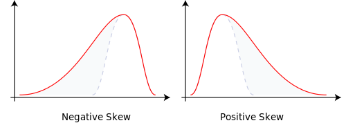
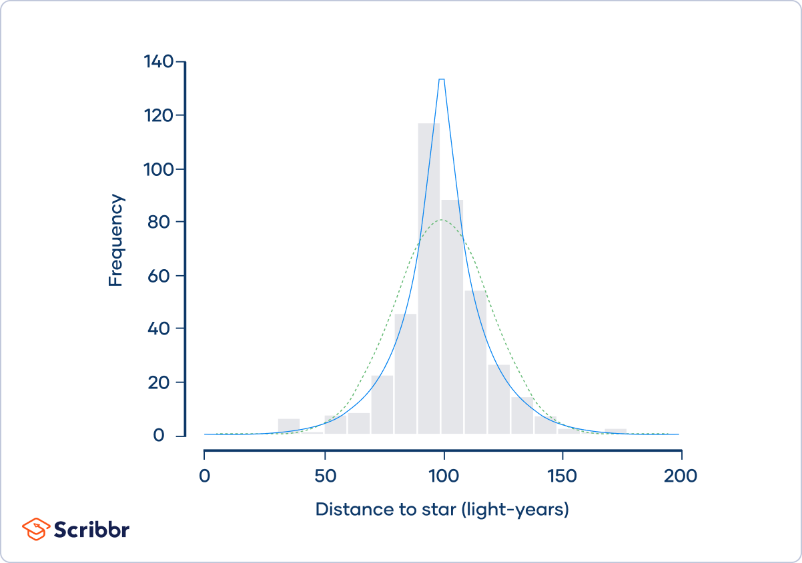

[Aug 28, 2024, Probability Review -- Lecture](01_Aug-28_Probability-Review.html) 

[Aug 29, 2024, Probability Review -- Exercise](02_ex1.html) 

[Aug 30, 2024, Probability Review -- Lab](03_applications.html) 

[Sept 11, 2024, Hypothesis Testing -- Lecture](04_Sept_11_lecture.html) 

[Sept 13, 2024, OLS -- External Resource](images/matrix_OLS_NYU_notes.pdf)

[Sept 13, 2024, OLS -- Lecture](06_Sept_13_OLS.html)

[Sept 13, 2024, Linear Regression -- Lab](05_Sept_13_OLS-lab.html)


This webpage is based on materials from Bent Nielsen’s Lecture Notes for Core Econometrics. 

**Office hour**: By appointment.

**Office location**: Hovedbygning A257.

<!--chapter:end:index.Rmd-->

---
title: "Probability Review -- Lecture"
author: "Menghan Yuan"
date: "Aug 28, 2024"
output: 
    bookdown::html_document2:
        mathjax: "https://cdnjs.cloudflare.com/ajax/libs/mathjax/2.7.5/MathJax.js?config=TeX-AMS_CHTML.js"
        self_contained: false
        toc: true
        toc_float: true
        toc_depth: 4
        number_sections: false
        css: "style.css"
---


<SCRIPT language="JavaScript" SRC="my_jxscript.js"></SCRIPT>

<style>
/* Long Fig caption justify alignment */
.caption {
  margin: auto;
  text-align: left;
}
</style>

\newcommand{\indep}{\perp \!\!\! \perp}

<a class="top-link" href="#top" id="js-top">↑</a>


```{r setup, include=F, echo=F}
library(knitr) # load packages
library(kableExtra)
library(tidyverse)
library(latex2exp)
library(stargazer)
library(bookdown)

# don't show code unless we explicitly set echo = TRUE
opts_chunk$set(echo = TRUE, message=FALSE, fig.align="center", fig.pos = "H")
opts <- options(knitr.kable.NA = "")

## control long outputs by using eg `max.lines = 10`
hook_output_default <- knitr::knit_hooks$get('output')
truncate_to_lines <- function(x, n) {
   if (!is.null(n)) {
      x = unlist(stringr::str_split(x, '\n'))
      if (length(x) > n) {
         # truncate the output
         x = c(head(x, n), '...\n')
      }
      x = paste(x, collapse = '\n') # paste first n lines together
   }
   x
}
knitr::knit_hooks$set(output = function(x, options) {
   max.lines <- options$max.lines
   x <- truncate_to_lines(x, max.lines)
   hook_output_default(x, options)
})
```


**Econometrics**

-   Use of statistical methods to analyse economic data, and to study economic relationships.
-   This includes testing economic theories, quantifying relationships, making predictions about counterfactual scenarios, and forecasting future outcomes.
-   Econometric practice.
-   Econometric theory.

**Types of Data**

-   Cross-section - observations on units at some point in time
    -   Examples: earnings of individuals; exam results of schools; GDP per capita of countries
-   Time-series - observations on same unit at different points in time
    -   Examples: quarterly GDP; monthly unemployment; daily exchange rates
-  Panel data - repeated observations over time on same units (or time-series data for multiple units)
    -   Examples: household expenditures; production of manufacturing firms; growth of OECD countries
-  Data sources - many and varied
    -   Examples: national statistical agencies; international organisations; company accounts; tax returns (anonymised); household surveys; fieldwork
-  Some data issues - imperfect measurement; quantity measured ̸= quantity of interest; missing values; non-random samples

**Course Aims**: statistical foundations, fundamental concepts, and basic methods for cross-section data.

- linear regression using cross-section data, 
- hypothesis testing, 
- properties of estimators and large-sample theory.

___ 

# Random Variables, Probabilities, Kolmogorov's Axioms

## Random Variables

- Key concept used to describe outcomes which are uncertain.
- Example: Coin toss.
    - two possible outcomes: heads or tails 
    - let $X=0$ if heads and $X=1$ if tails 
    - $X$ is a random variable
- More generally, a numerical representation or quantitative function of the possible outcomes.
- After the event, the observed outcome is the realized value or realization of the random variable.


**Discrete random variables** take a finite number of possible values.

Simplest case: only 2 possible values. Binary random variables (e.g. $X$ in the previous slide)

- is an individual employed or not?
- is a country an oil exporter or not?

Can be more than two outcomes. 

- which mode of transport (walking, cycling, car, bus, train,. . . ) does an individual use to travel between home and work?
- which brand of breakfast cereal did I eat this morning?


**Continuous random variables** may take infinitely many possible values.

Examples: 
- height of students in our class; 
- time interval between successive transactions in a financial market.


## Probabilities

**Probabilities** are used to describe the behavior of random variables.

Example: if we toss a fair coin and define the binary random variable $X$ as before, then we
have

$$
\mathbb{P}(X=0) = \mathbb{P}(X=1) = \frac{1}{2}
$$
Both probabilities lie between zero and one, and sum to one, as there are only 2 possible outcomes.


More generally, for discrete random variables, we denote the probability of outcome x using $\mathbb{P}(X = x)$ — sometimes written as $\text{P}(X = x)$ or $\text{Pr}(X = x)$.

<span style='color:#337ab7'>Standard convention</span>: Capital letters denote the random variable, lower case letters denote a particular realization of the random variable.

- For continuous random variables, the probability of any single outcome is equal to **zero**.
- For continuous random variables we focus on interval probabilities, e.g.

$$
\mathbb{P}(\text{height}>6 \text{ feet}), \qquad \mathbb{P}(5000 \text{ kr}\le \text{weekly wage} < 6000 \text{ kr}), 
$$

## Kolmogorov's axioms

For a discrete random variable Y which may take one of $K$ possible <span style='color:#008B45FF'>*mutually exclusive*</span> (or <span style='color:#008B45FF'>*disjoint*</span>) outcomes denoted by $y_1, y_2, \ldots, y_K,$ any potential set of probabilities should satisfy Kolmogorov’s axioms:

1. $\mathbb{P}(Y=y_i)\ge 0$, for $j=1,2,\ldots,K.$
2. $\mathbb{P}(Y=y_1 \text{ or } Y=y_2 \text{ or } \ldots \text{ or } Y=y_K)=1.$
3. $\mathbb{P}(Y=y_j \text{ or } Y=y_k) = \mathbb{P}(Y=y_j) + \mathbb{P}(Y=y_k)$ for $j\ne k.$

Note: 

- <span style='color:#008B45FF'>Mutually exclusive</span> means that the events cannot occur at the same time. Formally said, $X$ is a set of mutually exclusive events <span style='color:#337ab7'>if and only if</span>

<div class = "boxed">

Given any $E_i, E_j \in X$, if $E_i \ne E_j$ then 
$$E_i \cap E_j = \varnothing$$
</div>

- As a consequence, mutually exclusive events have the property: $P(A\cap B)=0.$

This set of axioms can be generalized to apply to probabilities involving <span style='color:#008B45FF'>continuous random variables</span>.

For each *event* $E$ in the *sample space* $\Omega$,

1. $\mathbb{P}(E)\ge 0$ for all $A\in \Omega .$
2. $\mathbb{P}(\Omega)=1.$ Probability of the sample space $\Omega$ is one.
3. If $E_1, E_2, E_3, \cdots$ are disjoint events, then
$$\mathbb{P}(E_1\cup E_2\cup E_3 \cdots)=\mathbb{P}(E_1)+\mathbb{P}(E_2)+\mathbb{P}(E_3)+\cdots$$
For instance, if the random variable $W$ represents weekly wages in kr, and we consider the mutually exclusive events
$$
5000 \text{ kr} \le W < 5500 \text{ kr}  \qquad 5500 \text{ kr} \le W < 6000 \text{ kr} 
$$
then
$$
\begin{align}
&\text{P}(5000 \text{ kr} \le W < 5500 \text{ kr or } 5500 \text{ kr} \le W < 6000  \text{ kr}) \\
=\, &\text{P}(5000 \text{ kr} \le W < 5500 \text{ kr}) + \text{P}(5500 \text{ kr} \le W < 6000 \text{ kr})
\end{align}
$$
since the two events are mutually exclusive.


___

```{example, ex1}
In a presidential election, there are four candidates. Call them A, B, C, and D. Based on our polling analysis, we estimate that A has a 20 percent chance of winning the election, while B has a 40 percent chance of winning. What is the probability that A or B win the election?
```


<button onclick="myFunction('myDIV')">Solution1</button>

<div id="myDIV" style="display: none; color: blue;">
  $$
  \begin{aligned}
  P(\textrm{A wins or B wins}) 
  &= P\big(\{\textrm{A wins}\} \cup \{\textrm{B wins}\}\big) \\
  &= P(\{\textrm{A wins}\})+ P(\{\textrm{B wins}\}) \\
  &= 0.2 + 0.4 \\
  &= 0.6
  \end{aligned}
  $$
</div>


<!------------------------------------------------------------------------>

___

# Sample vs. Population

- In econometrics, the distinction between <span style='color:#008B45FF'>sample</span> and <span style='color:#008B45FF'>population</span> is very important. 

- In general, any object that can be calculated based on observed quantities is a sample quantity.

-  Describing the idea of population requires some more definitions but for the time being suffice to say that the central idea is that there is some <span style='color:#008B45FF'>data generating process (DGP)</span> which generates the data that we observe. Any quantity, the calculation of which requires one to know the DGP, is a <span style='color:#008B45FF'>population quantity</span>.


Example: Recording the outcomes from $n$ tosses of a fair coin would give us a sample of data.

- Denote the outcomes of each toss by $X_1, X_2,\ldots,X_n,$ or simply $X_i$ for $i = 1,2,...,n,$ where each $X_i$ takes the value 0 (heads) or 1 (tails), as before, and $n$ is the sample size.

- For example, with $n = 10$, we might observe 4 heads ($X_i = 0$) and 6 tails ($X_i = 1$).

- We refer to $\frac{4}{10}$ as the <span style='color:#008B45FF'>sample frequency</span> of the outcome heads, and $\frac{6}{10}$ as the <span style='color:#008B45FF'>sample frequency</spam> of the outcome tails.


Define the indicator function $\mathbb{I}(X_i=0)$:
$$
\begin{aligned}
\mathbb{I}(X_i=0) = \begin{cases} 
1 & \text{if } X_i=0 \\
0 & \text{if } X_i=1 
\end{cases}
\end{aligned}
$$
Alternatively, you can write $\mathbb{I}(X_i=0) = 1-X_i$. 

## Sample estimators

- The sample frequency of the outcome 0 then corresponds to the sample average of the indicator function:
$$
\hat{f}(0) = \hat{f}(X_i=0) = \frac{1}{n}\sum_{i=1}^n \mathbb{I}(X_i=0)
$$
- <span style='color:#337ab7'>Notational convention</span>: It is common to add a “hat” (∧) to sample objects which mimic or estimate an unknown population object.

- In the previous example, the indicator $\mathbb{I}(X_i = 0)$ takes the value 1 in 4 of the 10 cases, therefore yielding
$$
\hat{f}(0) = \frac{4}{10}
$$
- Similarly,letting $\mathbb{I}(X_i =1)=1$ if $X_i =1$ and $\mathbb{I}(X_i =1)=0$ if $X_i\ne 1$, we have
$$
\hat{f}(1) = \hat{f}(X_i=1) = \frac{1}{n}\sum_{i=1}^n \mathbb{I}(X_i=1)
$$
In our particular example, 
$$
\hat{f}(0) = \frac{6}{10}.
$$

## Population frequencies

- Consider tossing a coin. Let $X = 0$ correspond to observing heads and $X = 1$ correspond to observing tails. If we know that the coin is fair, then we know that
$$
P(X=0) = P(X=1) = \frac{1}{2}
$$
- This situation reflects a particular belief about the world, that the coin is fair. Such claims/beliefs about the underlying DGP generating the sample data are referred to as claims/beliefs about “the population”.

- In reality, it is usually infeasible to get the population measures. Therefore, we use samples drawn from populations to estimate unknown population quantities.


<!------------------------------------------------------------------------>
___

# Distribution functions

<span style='color:#008B45FF'>Population (cumulative) distribution function (CDF)</span>: For the scalar random variable $X$, the (cumulative) distribution function is
$$
F(x)=P(X\le x).
$$
Also written as $F_X(x)$. 

- The subscript, $X$, denotes the random variable of interest. 
- The argument, $x$, denotes the threshold value which the probability of $X$ smaller or equal to.


Cumulative distribution functions (CDF) exist for both continuous and discrete random variables.

- For discrete random variables, the CDF is a step function.
Cointoss: $X=0$ if heads, $X=1$ if tails. If the coin is fair,then
$$
\begin{aligned}
F(x) = P(X\le x) = 0  \quad & \text{for any } x<0, \\
F(x) = P(X\le x) = \frac{1}{2}  \quad & \text{for any } 0\le x<1, \\
F(x) = P(X\le x) = 1  \quad & \text{for any } x\ge 1. \\
\end{aligned}
$$

- Continuous CDF example. $X\sim \text{Uniform}(a,b)$ has the following CDF:
$$
F(x) = P(X\le x) = \begin{cases}
0 & \text{for any } x<a, \\
\frac{x-a}{b-a} & \text{for any } a\le x<b, \\
1 & \text{for any} x\ge b.
\end{cases}
$$
For continuous random variables the cdf is a continuous function. 

The sample counterpart of the CDF is the empirical distribution function. 
For example, let $W_1,W_2,...,W_n$ denote weekly wages for weeks $1,...,n,$ and define the indicator function 
$$
\begin{aligned}
\mathbb{I}(W_i ≤ w) = 
\begin{cases}
1 & \text{if } W_i ≤ w, \\
0 & \text{if } W_i > w.
\end{cases}
\end{aligned}
$$
The empirical distribution function is
$$
\hat{F}(w) = \frac{1}{n} \sum_{i=1}^n \mathbb{I}(W_i\le w).
$$

- If the underlying random variable is continuous, the empirical distribution function will look less and less like a step function as the sample size increases.
- If the underlying random variable is discrete, the empirical distribution function will still look like a step function as the sample size increases.
- Intuitively, as the *sample size increases*, the empirical distribution function should provide a good approximation to the distribution function of the underlying (discrete or continuous) random variable .

___

# Density functions

<span style='color:#008B45FF'>Probability Density functions (PDF)</span> are derived from CDF.

- PDFs for <span style='color:#008B45FF'>discrete random variables</span> (RV) are often referred to as probability mass functions
$$
f(x) = P(X=x).
$$
Also written as $f_X(x)$.
    - In the coin toss example, 
$$
f(0) = f(1) = \frac{1}{2}.
$$
    - Its relationship with CDF: 
$$
F(x) = P(X\le x) = \sum_{a\le x} f(a)
$$
where the sum is taken over all values of $a\le x$. 

    - <span style='color:#008B45FF'>Bernoulli distribution</span>. If $X\sim \text{Bernoulli}(p),$ where $p=0.5$. This corresponds to the fair coin toss with a probability of 0.5 having a head.
    - Its PDF can be written as
$$
f(x) = p^x(1-p)^{1-x} \quad \text{where } x\in\{0,1\}.
$$
That is 
$$
f(x) = \begin{cases}
p & \text{if } x=1 \\
1-p & \text{if } x=0 
\end{cases}.
$$
$p$ is called the parameter of the Bernoulli distribution. \
To include the parameter in the notation, one writes $f(x;p)$ instead of $f(x)$.

- For <span style='color:#008B45FF'>continuous RV</span>, $f(x)$ can be obtained by differentiating $F(x)$ w.r.t $x$,
$$
f(x) = \frac{dF(x)}{dx}.
$$
Conversely, CDF can be obtained by integrating the PDF,
$$
F(x) = P(X\le x) = \int_{-\infty}^{x} f(a) da
$$
    - Example: <span style='color:#008B45FF'>Standard Normal Distribution</span>. If $Z\sim N(0,1)$, then its PDF is given by
$$
\phi(z) = \frac{1}{\sqrt{2\pi}} \exp \left(-\frac{z^2}{2}\right) .
$$
Its CDF is:
$$
\Phi(z) = P(Z\le z) =\int_{-\infty}^z \phi(a)da.
$$

    - Tail probabilities of the standard normal distribution play an important role in hypothesis testing, and in formulating confidence intervals for parameters of interest.
    - For example, we have $$\Phi(−1.96) = P(Z ≤ −1.96) = 0.025.$$ By symmetry, $$\Phi(1.96) = P(Z ≤ 1.96) = 0.975.$$ Consequently, the probability that any draw from the standard normal distribution will be between $\pm 1.96$ is $95\%$.


```{r fig.cap="The $\\Phi$ and $\\phi$ ($f_Z(.)$) functions (CDF and pdf of standard normal).", out.width="70%", echo=FALSE}
include_graphics("https://drive.google.com/thumbnail?id=1nxfdIKXgZvOqXVSeA3h_hf0yxmsM361l&sz=w1000")
```

**Distribution function visualization tool**: \
<https://seeing-theory.brown.edu/probability-distributions/index.html#section2>

<!------------------------------------------------------------------------>
___

# Quantiles

The quantile function is given by
$$
q_{\tau} = F^{-1}(\tau).
$$

- Example: Let $Z\sim N(0,1)$. Then we have
$$
\begin{aligned}
q_{0.5} &= 0, \\
q_{0.95} &= 1.645, \\
q_{0.975} &= 1.960, \\
q_{0.995} &= 2.576. \\
\end{aligned}
$$
- Some quantiles have special names:
    - $q_{0.5}$ is the median, or $50^{th}$ percentile.
    - $q_{0.1}$ is the first decile, $q_{0.25}$ is the first quartile.


<!------------------------------------------------------------------------>
___

# **Transformations**

Q: If $X \sim N (0, 1)$ then what is the distribution of the new random variable $Y=X^2$?

A: We use transformation -- change of variable formula, to represent the distribution function of $Y$ using distribution function of $X$.

<div class = "boxed">
Let $X$ be a random variable with the distribution function $F_X(x) = P(X \le x).$

Define the new RV $Y=g(X)$, where $g(\cdot)$ is strictly monotone, i.e., strictly increasing or decreasing.

- If $g(\cdot)$ is strictly increasing, then
$$
F_Y (y) = P(Y \le y) = P\left(g(X) \le y\right) = P\left(X ≤ g^{−1}(y)\right) = F_X\left(g^{−1}(y)\right).
$$
- If $g(\cdot)$ is strictly decreasing, then
$$
F_Y(y) = P(Y \le y) = P\left(g(X) \le y\right) = P\left(X \ge g^{−1}(y)\right) = 1−F_X\left(g^{−1}(y)\right) .
$$
</div>

What if $g(\cdot)$ is not strictly monotonic? Solutions exist, but we will not encounter such cases.

---

```{example, ex2}
Let $Y=g(X)=\mu+\sigma X$ where $\sigma>0$. Representing the CDF of $Y$ using $F_X(x)$.
```


<button onclick="myFunction('myDIV2')">Solution2</button>
<div id="myDIV2" style="display: none; color: blue;">
Note that $g(x)$ is strictly increasing in $x$.
The inverse function is
$$
X = g^{-1}(Y) = \frac{Y-\mu}{\sigma}
$$
and so
$$
F_Y(y) = F_X\left(g^{-1}(y)\right) = F_X\left(\frac{y-\mu}{\sigma}\right)
$$
</div>

---


The density function can be obtained by:
$$
f_Y(y) = f_X(g^{-1}(y)) \cdot \left\vert \frac{\partial }{\partial y} g^{-1}(y) \right\vert .
$$
This is known as the <span style='color:#008B45FF'>change of variable formula</span> for density functions. \
`||` denotes the absolute value of the differential. 


Continue with the last example, the density function of $Y$ is:
$$
f_Y(y) = \frac{1}{\sigma} f_X \left(\frac{y-\mu}{\sigma}\right) .
$$
Let $X \sim N(0, 1)$ and let $Y$ be defined as before. Then
$$
\begin{aligned}
f_Y(y) &= \frac{1}{\sigma} \phi \left(\frac{y-\mu}{\sigma}\right) \\
&= \frac{1}{\sqrt{2\pi\sigma^2}} \exp \left(-\frac{(y-\mu)^2}{2\sigma^2}\right) .
\end{aligned}
$$
This is the density function for a normal random variable with mean $\mu$ and variance $\sigma^2$. We write $Y ∼ N(\mu, \sigma^2)$. 


<!------------------------------------------------------------------------>
___

# Moments

- We often summarize properties of distributions using their moments.
- The first moment is called the <span style='color:#008B45FF'>expected value</span> or <span style='color:#008B45FF'>expectation</span>.
    - This is a measure of the central tendency of the distribution of a random variable; other measures of central tendency include the median and the mode.


For a continuous random variable with the density function $f(x)$, the $n^{th}$ order moment is given by
$$
\mathbb{E}(X^n) = 
\begin{cases}
\displaystyle \sum_{x}x^n f(x) & \text{for discrete } X \\
\displaystyle \int_{-\infty}^{\infty} x^n f(x) dx & \text{for continuous } X \\
\end{cases}
$$
if the integral exists.

$\sum_{x}$ denotes the summation over all possible values of $x$.
For discrete RV $x$, we sometimes write $f(x)$ as $P(X=x)$.


## Expectation

Expectation are denoted by $\mathbb{E}(X)$ or $\mathbb{E}_X(X)$ to denote the expectation is taken over the RV $X$.
$$
\mathbb{E}(X) = 
\begin{cases}
\displaystyle \sum_{x}x f(x) & \text{for discrete } X \\
\displaystyle \int_{-\infty}^{\infty} x f(x) dx & \text{for continuous } X \\
\end{cases}
$$

___

```{example, ex3}
Let $X\sim \text{Bernoulli}(p)$. Calculate $\mathbb{E}(X)$.
```


<button onclick="myFunction('myDIV3')">Solution3</button>
<div id="myDIV3" style="display: none; color: blue;">
The PDF of Bernoulli is given by
$$
f(x) = p^x(1-p)^{1-x} \quad \text{where } x\in\{0,1\}.
$$
Hence 
$$
\begin{aligned}
\mathbb{E}(x) &= 0\times P(X=0) + 1\times P(X=1) \\
&= 0 \times (1-p) + 1\times p \\
&= p.
\end{aligned}
$$
</div>

___


A useful property of expected values is that the expectation operator is a <span style='color:#337ab7'>linear operator</span>, meaning that we have
$$\mathbb{E}(a+bX) = a+b\mathbb{E}(X).$$
for any two constants $a$ and $b$.

In general,
$$
\begin{aligned}
\mathbb{E}\left[\sum_{i=1}^n (a_i+b_iX_i) \right] &= \sum_{i=1}^n \mathbb{E}(a_i+b_iX_i)  \\
&= \sum_{i=1}^n \left(a_i+b_i\mathbb{E}(X_i) \right)
\end{aligned}
$$

___

```{example, ex4}
Let $X\sim N(0,1)$ and $Y=\mu+\sigma X$. Calculate $\mathbb{E}(Y)$.
```

<button onclick="myFunction('myDIV4')">Solution4</button>
<div id="myDIV4" style="display: none; color: blue;">
$$
\begin{aligned}
\mathbb{E}(Y) &= \mathbb{E}(\mu+\sigma X) \\
&= \mu + (\sigma \times \mathbb{E}(X)) \\
&= \mu + (\sigma \times 0) \\
&= \mu
\end{aligned}
$$
</div>

___


- Expectation is a population quantity because it requires knowledge of the density function.

- The sample analogue of the expected value is the <span style='color:#008B45FF'>sample mean</span> or <span style='color:#008B45FF'>sample average</span>.
    - Letting $X_1,X_2,...,X_n$ denote $n$ observations on a variable $X$, the sample mean is
    $$
    \overline{X} = \frac{1}{n} \sum_{i=1}^n X_i
    $$
- It's important to distinguish between <span style='color:#337ab7'>population parameters</span> and <span style='color:#337ab7'>sample statistics</span>. 
    - Population parameters: describe entire a population, often unknown. We often use $\mu$ to denote population expectation.
    - Sample statistics: describes a **fraction** of a population, i.e., a sample, and are used to estimate/infer population parameter. We often use $\overline{X}$ to denote sample average.
- Sample mean has some desirable properties as an <span style='color:#008B45FF'>estimator</span> of the expected value of a random variable.


**Expectations of functions of RVs**

If $X$ is a random variable and $g$ is a function such that $g(X)$ is also a random variable, the expected value of $g(X)$ is given by
$$
\mathbb{E}\left[g(X)\right] = \begin{cases}
\displaystyle \sum_{x}g(x) f(x) & \text{for discrete } X \\
\displaystyle \int_{-\infty}^{\infty} g(x) f(x) dx & \text{for continuous } X 
\end{cases}
$$

## Variance

The variance is obtained by setting $g(X) = \left[X − \mathbb{E}(X)\right]^2$:
$$
\begin{aligned}
\sigma^2 \equiv \text{Var}(X) &= \mathbb{E}\left[\left(X − \mathbb{E}(X)\right)^2\right] \\
&= \begin{cases}
\displaystyle \sum_{x} \left(X − \mathbb{E}(X)\right)^2 f(x) & \text{for discrete } X \\
\displaystyle \int_{-\infty}^{\infty} \left(X − \mathbb{E}(X)\right)^2 f(x) dx & \text{for continuous } X 
\end{cases}
\end{aligned}
$$

- The variance is also called the second moment about the mean of the random variable $X$, or the second central moment of $X$.
- The $n^{th}$ order central moment is given by
$$
\mathbb{E}\left[\left(X − \mathbb{E}(X)\right)^n\right].
$$
- The variance gives a measure of dispersion of the random variable around its expected value; other measures of dispersion can be based on quantiles, such as the interquartile range $(q_{0.75} − q_{0.25}).$

- Note that variances are non-negative, since $[X − E(X)]^2 \ge 0$ for all possible values taken by the random variable $X$.

- The variance can also be expressed as
$$
\begin{aligned}
\color{#008B45FF}{\text{Var}(X)} &= \mathbb{E}\left[\left(X − \mathbb{E}(X)\right)^2\right] \\
&= \color{#008B45FF}{\mathbb{E}[X^2] - [\mathbb{E}(X)]^2} .
\end{aligned}
$$

___

```{example, ex5}
Let $X\sim \text{Bernoulli}(p)$. Calculate $\text{Var}(X)$.
```

<button onclick="myFunction('myDIV5')">Solution5</button>
<div id="myDIV5" style="display: none; color: blue;">
$$
\begin{aligned}
\text{Var}(X) &=  \mathbb{E}\left[\left(X − \mathbb{E}(X)\right)^2\right]  \\
&= (0-p)^2\times f(0) + (1-p)^2\times f(1) \\
&= p^2(1-p) + (1-p)^2p \\
&= (1-p) (p^2+p(1-p))\\
&= p(1-p)
\end{aligned}
$$
Alternatively, Since $0^2 = 0$ and $1^2 = 1$, we have $X^2 = X$ implying that $E(X^2) = E(X) = p$. Therefore,
$$
\text{Var}(X) = E[X^2]-E[X]^2 = p-p^2=p(1-p)
$$ 
</div>

___

- The variance operator is the expectation of a quadratic function, and hence not a linear operator; instead we have the relation
$$
\text{Var}(a + bX) = b^2\text{Var}(X) 
$$
for any two constants $a$ and $b$.

___

```{example, ex6}
Let $X\sim N(0,1)$ and $Y=\mu+\sigma X$. Calculate $\text{Var}(Y)$.
```

<button onclick="myFunction('myDIV6')">Solution6</button>
<div id="myDIV6" style="display: none; color: blue;">
$$
\text{Var}(Y) = \text{Var}(\mu+\sigma X) = \sigma^2 \text{Var}(X) = \sigma^2
$$
Thus, $Y\sim N(\mu, \sigma^2)$.
</div>

___

**Variance of sum of RVs**

if $Z=X+Y$, then

$$
\begin{aligned}
\text{Var}(Z) &= \text{Cov}(Z,Z) \\
&= \text{Cov}(X+Y, X+Y) \\
&= \text{Cov}(X,X) + \text{Cov}(X,Y) + \text{Cov}(Y,X) + \text{Cov}(Y,Y) \\
&= \text{Var}(X) + \text{Var}(X) + 2\text{Cov}(X,Y).
\end{aligned}
$$

More generally, for $a_i\in \mathbb{R}, i=1,\ldots,n$, we conclude:

$$
\text{Var}\left(\sum_{i=1}^n a_iX_i \right) = 
\sum_{i=1}^n a_i^2 \text{Var}(X_i) + \sum_{i=1}^n\sum_{j=1}^n a_ia_j \text{Cov}(X_i, X_j).
$$

Or equivalently, 

$$
\text{Var}\left(\sum_{i=1}^n a_iX_i \right) = 
\sum_{i=1}^n a_i^2 \text{Var}(X_i) + 2\sum_{i=2}^n\sum_{j=1}^{i-1} a_ia_j \text{Cov}(X_i, X_j).
$$

The <span style='color:#337ab7'>sample analogue of the variance</span> for a sample of observations $X_1,...,X_n$ is the sample variance. 

Two ways to compute the <span style='color:#008B45FF'>**sample variance**</span>:

- unadjusted sample variance, also called biased sample variance:
$$
\hat{\sigma}^2 = \frac{1}{n} \sum_{i=1}^n [(X_i-\overline{X})^2]
$$

- adjusted sample variance, also called unbiased sample variance 
$$
\hat{\sigma}^2 = \frac{1}{n-1} \sum_{i=1}^n [(X_i-\overline{X})^2]
$$
    The latter subtracts 1 from n in the denominator, which is known as a degrees of freedom correction. This version has some desirable properties but we will not discuss these for now. Suffice to say that both versions are usually fine.
    
    The sample variance is also denoted as $\color{#008B45FF}{s^2}$.


<span style='color:#008B45FF'>Standard deviation</span> is the square root of the variance:
$$
\text{sd}(X) = \sqrt{\text{Var}(X)}.
$$


The sample standard deviation, denoted as $\hat{\sigma}$ or $s$, is given by:
$$
\hat{\sigma} = \sqrt{\hat{\sigma}^2}
$$

___

## Covariance

Let $X$ and $Y$ be two random variables. Then, the <span style='color:#008B45FF'>covariance</span> between $X$ and $Y$ is given by
$$
\gamma \equiv \text{Cov}(X,Y) = \mathbb{E}\left[(X-\mathbb{E}[X])(Y-\mathbb{E}[Y])\right] .
$$

- Covariance provides information about the direction of comovement between two random variables.
- Covariance between $X$ and $Y$ is also written as $\sigma_{XY}$.
- The magnitude of covariance does not give any information on the strength of association between two random variables. In other words, $\text{Cov}(X, Y) = 100$ and $\text{Cov}(W, Z) = 1$ does not necessarily mean that $X$ and $Y$ are much strongly related compared to $W$ and $Z$.


More formally

$$
\begin{aligned}
\textrm{Cov}(X, Y) = \begin{cases}
\sum_y\sum_x[X-\mathbb{E}(X)][Y-\mathbb{E}(Y)]f(x,y) & \textrm{for } X, Y \textrm{ discrete}  \\
\iint[X-\mathbb{E}(X)][Y-\mathbb{E}(Y)]f(x,y) dxdy   & \textrm{for } X, Y \textrm{ continuous}  \\
\end{cases}
\end{aligned}
$$

The <span style='color:#008B45FF'>sample covariance</span>, $\hat{\gamma}$, in a sample of $n$ observations on $(X_i,Y_i)$ is

$$
\hat{\gamma} = \frac{1}{n-1}\sum_{i=1}^n (X_i-\overline{X})(Y_i-\overline{Y})
$$


## Correlation

<span style='color:#008B45FF'>Correlation</span> is a scaled measure of covariance.

The correlation between two random variables $X$ and $Y$ is defined
$$
\text{Corr}[X,Y] = \rho_{X,Y} = \frac{\sigma_{XY}}{\sigma_X\sigma_Y}.
$$

- Correlation is always in the interval $[−1, 1]$.
- Unlike covariance, correlations between different pairs of random variables are comparable.

___

```{example, ex7}
Let $X, Y, W, Z$ be random variables with $\text{Var}[X] = 200$, $\text{Var}[Y] = 200$, $\text{Var}[W] = 1$, $\text{Var}[Z]=1$, $\text{Cov}[X,Y]=100$ and $\text{Cov}[W,Z]=1$. \
Compare $\text{Corr}(X,Y)$ and $\text{Corr}(W,Z)$.
```

<button onclick="myFunction('myDIV7')">Solution7</button>
<div id="myDIV7" style="display: none; color: blue;">
$$
\begin{aligned}
\text{Corr}[X,Y] &= \frac{100}{\sqrt{200\times 200}} = \frac{1}{2} \\
\text{Corr}[W,Z] &= \frac{1}{\sqrt{1\times 1}} = 1.
\end{aligned}
$$
</div>

___

## Skewness and Kurtosis

Normalized or standardized central moments are defined as
$$
\mu_r = \mathbb{E}\left\{\left[\frac{X-\mathbb{E}(X)}{\text{sd}(X)}\right]^r\right\}
$$

- $\mu_3$ is a measure of skewness or asymmetry of the distribution, with symmetric distributions having $\mu_3 = 0$. 
    - $\mu_3<0$ means negatively skewed, i.e., long left tail.
    - $\mu_3>0$ means positively skewed, i.e., long right tail.

```{r fig.cap="Diagram of Skewness.", out.width="70%", echo=FALSE}

```

- $\mu_4$ is a measure of kurtosis, indicating the relative weights of the probability in the middle of the distribution and the probability in the tails, or how ‘peaked’ the density function is.

The kurtosis for any normal distribution is three. For this reason, we subtract three from $\mu_4$ to get the "excess kurtosis".

- $\mu_4-3>0$ indicate a heavy-tailed distribution with higher chances of outliers.
    - Note that we cannot infer from kurtosis the shape of the peak. $\mu_4-3>0$ can associate with either a falttened (e.g., $t$-distribution, see Fig. \@ref(fig:fig-t)) or a pointy peak (Laplace distribution, see Fig. \@ref(fig:fig-Laplace)).
- $\mu_4-3<0$ indicate a light-tailed distribution with lower chances of outliers.


```{r fig-t, fig.cap="Examples of heavy-tailed distributions.", out.width="70%", echo=FALSE}
include_graphics("images/t distribution.png")
```

$t$-distribution has *higher* kurtosis than normal distributions. 

- Meaning that $t$-distribution has a higher probability of obtaining values that are far from the mean than a normal distribution.
- It is less peaked in the center and higher in the tails than normal distribution.
- As the degree of freedom increases, $t$-distribution approximates to normal distribution, kurtosis decreases and approximates to 3.

```{r}
set.seed(125)
rnorm(1000) %>% moments::kurtosis()
rt(n=1000, df=1) %>% moments::kurtosis()
rt(n=1000, df=2) %>% moments::kurtosis()
rt(n=1000, df=10) %>% moments::kurtosis()
rt(n=1000, df=30) %>% moments::kurtosis()
```


```{r fig-Laplace, fig.cap="**Laplace distribution**. The dotted green curve shows a normal distribution. The blue curve shows a Laplace distribution with kurtosis of 6.54. On the far left and right sides of the distribution—the tails—the space below the Laplace distribution curve (blue) is slightly thicker than the space below the normal distribution curve (green). This is an example of a heavy-tailed distribution yet with a *sharper* peak.", out.width="70%", echo=FALSE}

```


**Distinguish kurtosis from standard deviation/variance.**

- Standard deviation and kurtosis are both measures of the variability of a distribution, but they are not directly related. 
    - Two distributions with identical means and standard deviations can have very different shapes, and kurtosis is one of the measures of that difference. 
    - It looks at how much of the ‘weight’ of the distribution (recall that the total weight, or the area under the curve, is $1$) is sitting in the tails as opposed to the middle of the distribution. 


- Standard deviation is useful for measuring the *spread*. \
  Kurtosis focuses on detecting *outliers*. 

___

# Independence

$X_1$ and $X_2$ are said to be independent if and only if
$$
P(X_1\le x_1 \text{ and } X_2\le x_2) = P(X_1\le x_1)P(X_2\le x_2) \text{ for all }x_1 \text{ and } x_2,
$$
denoted as $X_1 \indep X_2$.

**Distinguish from uncorrelated.**

- If $\textrm{Corr}(X,Y)=0$, we say that $X$ and $Y$ are <span style='color:#337ab7'>uncorrelated</span> or orthogonal, denoted by $X {\color{#337ab7}\perp} Y$ (perpendicular symbol).

- $X {\color{#337ab7}\indep} Y$ (double perpendicular symbol) denotes $X$ and $Y$ are <span style='color:#337ab7'>independent</span>.

- $X \indep Y \Rightarrow X \perp Y$,  in plain language, independence implies zero correlation. \
Note that this relationship does not necessarily hold in the reverse direction: two variables with zero covariance can still be dependent.

**Independent and Identically Distributed**

- Two (or more) independent random variables which have the same distribution are said to be <span style='color:#008B45FF'>independent and identically distributed</span>, or <span style='color:#008B45FF'>iid</span>.

- When would you expect the identical distribution assumption to fail? It typically fails when there is sufficient reason to believe that part of the sample has different distributional characteristics. This is called heterogeneity.

- We will mostly focus on iid data.

**Sum of iid RVs**

- Suppose that $Y_1, Y_2, ...,Y_n$ are independent and identically distributed random variables. 
- Note that they have the same expected value $E(Y_i)=\mu$ and the same variance $\text{Var}(Y_i)=\sigma^2$ for $i = 1, 2, ..., n.$

- The <span style='color:#337ab7'>**expected value of the sample mean**</span> is:
$$
\begin{aligned}
\mathbb{E}(\overline{Y}) &= \mathbb{E}\left[\frac{1}{n} \sum_{i=1}^n Y_i \right] \\
&= \frac{1}{n}  \sum_{i=1}^n \mathbb{E}(Y_i) \\
&= \frac{1}{n} \cdot n \cdot \mathbb{E}(Y_i) \quad (Y_i \text{ is iid}) \\
&= \mathbb{E}(Y_i) = \mu
\end{aligned}
$$
    We say that the sample mean Y is an <span style='color:#337ab7'>unbiased</span> estimator of the expected value of the random variable.

    Suppose $\theta$ is some population quantity, and $\hat{\theta}$ is an estimator of it. We say that $\hat{\theta}$ is an unbiased estimator of $\theta$ if
$$
\mathbb{E}(\hat{\theta}) = \theta .
$$
    Unbiasedness means that our estimator is doing what it is supposed to do on average.


- The <span style='color:#337ab7'>**variance of the sample mean**</span> is:
$$
\begin{aligned}
\text{Var}(\overline{Y}) &= \text{Var}\left[\frac{1}{n} \sum_{i=1}^n Y_i \right] \\
&= \frac{1}{n^2} \cdot n \cdot \text{Var}(Y_i) \\
&= \frac{\text{Var}(Y_i)}{n} = \frac{\sigma^2}{n}
\end{aligned}
$$
- Importantly, the variance of $Y$ falls as the number of observations ($n$) on the random variable increases; the sample mean accumulates information about the central tendency of the distribution as we add more observations, and we become less uncertain about the true value of $E(Y_i)$.

- Indeed, we can note that $\text{Var}(Y) \to 0$ as the sample size $n \to \infty$; in other words, in the limit we would know the value of $E(Y_i)$.

# Reading

J. Evans (2021), *Business analytics: methods, models, and decisions*, chaps 2-6.


<!--chapter:end:01_Aug-28_Probability-Review.Rmd-->

---
title: "Probability Review -- Exercise"
author: "Menghan Yuan"
date: "Aug 29, 2024"
output:
    bookdown::html_document2:
        mathjax: "https://cdnjs.cloudflare.com/ajax/libs/mathjax/2.7.5/MathJax.js?config=TeX-AMS_CHTML.js"
        self_contained: false
        toc: true
        toc_float: true
        toc_depth: 4
        number_sections: false
        css: "style.css"
---

```{r setup, include=F, echo=F}
library(knitr) # load packages
```

<ol>
<!---------------- question 1 ---------------->
<li> Use a probability table for the normal distribution (which can be found at the back of any statistics textbook, or via a Google search) to answer the following questions.
    <ol type="pa">
        <li>Let $X \sim N(0,1).$ What is $P(X > 1.96)$, $P(X > 2)$, $P(|X| < 2)$. </li>
        <li>Find $q$ such that $P(|X|>q)=p$ for $p=0.1$, $p=0.05$, $p=0.01.$ </li>
        <li>What is $P(X > 1.96)$ when $X \sim N(2,1)$ or $X \sim N(2,4)$?</li>
    </ol>
</li>

<!---------------- question 2 ---------------->
<li> Let $Y_1, \ldots, Y_n$ be independent $\text{Bernoulli}(p)$. Consider the two estimators $\hat{p}=\overline{Y}$ and $\tilde{p}=Y_n$.
    <ol type="pa">
        <li>Show that $\mathbb{E}(\hat{p})=\mathbb{E}(\tilde{p})=p .$</li>
        <li>Find and compare the variances of $\hat{p}$ and $\tilde{p}$. Which has smaller variance?</li>
    </ol>
</li>
Note: <em>The result of part (a) shows that these are unbiased estimators. When comparing two unbiased estimators, the estimator with smaller variance is said to be more efficient, which is investigated in part (b).</em>

<!---------------- question 3 ---------------->
<li> Let $X$ be a continuous random variable with the exponential distribution. The cdf of $X$ is then given by
$$
F_X(x) = 1-\exp{(-x)} \quad \text{for } x>0
$$
    <ol type="pa">
        <li>Find the pdf of $X$.</li>
        <li>Find the cdf of $Y=\lambda X$, where $\lambda>0$, using the change of variable formula. </li>
        <li>Find the pdf of $Y$. </li>
    </ol>

</li>

<!--------------------------------------------->
</ol>


<!--chapter:end:02_ex1.Rmd-->

---
title: "Probability Review -- Lab"
author: "Menghan Yuan"
date: "Aug 30, 2024"
output: 
    bookdown::html_document2:
        mathjax: "https://cdnjs.cloudflare.com/ajax/libs/mathjax/2.7.5/MathJax.js?config=TeX-AMS_CHTML.js"
        self_contained: false
        toc: true
        toc_float: true
        toc_depth: 4
        number_sections: false
        css: "style.css"
---

<a class="top-link" href="#top" id="js-top">↑</a>


```{r setup, include=F, echo=F}
library(knitr) # load packages
library(kableExtra)
library(tidyverse)
library(latex2exp)
library(stargazer)
library(bookdown)
library(moments)

# don't show code unless we explicitly set echo = TRUE
opts_chunk$set(echo = TRUE, message=FALSE, warning=FALSE, fig.align="center", fig.pos = "H")
opts <- options(knitr.kable.NA = "")

## control long outputs by using eg `max.lines = 10`
hook_output_default <- knitr::knit_hooks$get('output')
truncate_to_lines <- function(x, n) {
   if (!is.null(n)) {
      x = unlist(stringr::str_split(x, '\n'))
      if (length(x) > n) {
         # truncate the output
         x = c(head(x, n), '...\n')
      }
      x = paste(x, collapse = '\n') # paste first n lines together
   }
   x
}
knitr::knit_hooks$set(output = function(x, options) {
   max.lines <- options$max.lines
   x <- truncate_to_lines(x, max.lines)
   hook_output_default(x, options)
})
```


We have Fama-French monthly pricing factor data from 2000-01 to 2024-06. 
We want to have a look at its descriptive statistics.

```{r}
data <- read_csv("data/FF_3Factors_US_monthly.csv")
get_stat <- function(x, q_list=c(0.025, 0.5, 0.975)){
    ## Return extended summary statistics with quantiles and sd.
    #    @q_list: vector of quantiles to calculate;
    x <- na.omit(x)
    c(summary(x), quantile(x, q_list), 
      "sd" = sd(x), 
      "skewness" = skewness(x),
      "kurtosis" = kurtosis(x)
      )
}
```

Have a preview of the data structure
```{r}
data %>% 
    knitr::kable(floating.environment="sidewaystable", digits = 5, escape=F) %>%
    kable_styling(bootstrap_options = c("striped", "hover"), full_width = F, latex_options="scale_down") %>% 
    scroll_box(width = "100%", height = "500px")
```

# Descriptive statistics

```{r descrptive-analysis, comment = ''}
apply(data[,-1], 2, get_stat) %>% 
    stargazer(type = "text", digits=2)
```


- sd(SMB) < sd(HML), meaning SMB has less dispersion, smaller spread.
- kurtosis(SMB) > kurtosis(HML), meaning SMB has more outliers.


## Distribution of SMB

Plot histogram, empirical density, and compare with normal density (in blue).
```{r}
ggplot(data, aes(x=SMB)) +
    geom_histogram(aes(y=..density..), 
                   fill="#BDBCBC", 
                   color="black", 
                   binwidth = 2, 
                   boundary=0) +
    geom_density(color="black") +
    stat_function(fun = dnorm, args = list(mean = 0, sd = 1), color="blue") +
    labs(x="Small minus big, SMB")
```

Issue: hard to see the tail behavior.

Solution: use Quantile-Quantile (Q-Q) plots.

The <span style='color:#008B45FF'>Q-Q plot</span>, or <span style='color:#008B45FF'>quantile-quantile plot</span>, is a graphical tool to help us assess if a set of data plausibly came from some theoretical distribution such as a normal distribution. 

- For example, if we run a statistical analysis that <span style='color:#337ab7'>assumes our **residuals** are normally distributed</span>, we can use a normal Q-Q plot to check that assumption. 

A QQ plot is a scatter plot created by plotting two sets of quantiles against one another. 

- If both sets of quantiles came from the same distribution, we should see the points forming a line that's roughly straight. 

```{r}
ggplot(data, aes(sample=SMB)) +
    geom_qq() +
    geom_qq_line(color="red") +
    labs(x="Theoretical quantiles", y="Sample quantiles", 
         title=sprintf("Normal Q-Q plot — SMB, sd: %.2f, kurtosis: %.2f", sd(data$SMB), kurtosis(data$SMB))) +
    scale_y_continuous(limits=c(-15,20))
```

<span style='color:#337ab7'>Standardize</span> SMB to improve visualization

- Without standardization, the scale of the RV will affect your judgement.

```{r}
ggplot() +
    geom_qq(aes(sample=with(data, (SMB-mean(SMB))/sd(SMB)))) +
    geom_qq_line(aes(sample=with(data, (SMB-mean(SMB))/sd(SMB))), color="red") +
    labs(x="Theoretical quantiles", y="Sample quantiles", 
         title=sprintf("Normal Q-Q plot — SMB, sd: %.2f, kurtosis: %.2f", sd(data$SMB), kurtosis(data$SMB))) 
```


## Distribution of HML

```{r}
ggplot(data, aes(x=HML)) +
    geom_histogram(aes(y=..density..), 
                   fill="#BDBCBC", 
                   color="black", 
                   binwidth = 2, 
                   boundary=0) +
    geom_density(color="black") +
    stat_function(fun = dnorm, args = list(mean = 0, sd = 1), color="blue") +
    labs(x="High minus low, HML")
```

```{r}
ggplot(data, aes(sample=HML)) +
    geom_qq() +
    geom_qq_line(color="red") +
    labs(x="Theoretical quantiles", y="Sample quantiles", 
         title=sprintf("Normal Q-Q plot — HML, sd: %.2f, kurtosis: %.2f", sd(data$HML), kurtosis(data$HML))) +
    scale_y_continuous(limits=c(-15,20))
```

<span style='color:#337ab7'>Standardize</span> HML to improve visualization
```{r}
ggplot() +
    geom_qq(aes(sample=with(data, (HML-mean(HML))/sd(HML)))) +
    geom_qq_line(aes(sample=with(data, (HML-mean(HML))/sd(HML))), color="red") +
    labs(x="Theoretical quantiles", y="Sample quantiles", 
         title=sprintf("Normal Q-Q plot — HML, sd: %.2f, kurtosis: %.2f", sd(data$HML), kurtosis(data$HML)))
```

___

# Sample estimators

**Sample mean** Let $X_1, \ldots, X_n$ denote $n$ observations on a variable $X$, the sample mean is

$$
\begin{align*}
\overline{X}=\frac{1}{n}\sum_{i=1}^nX_i
\end{align*}
$$

$\overline{X}$ is a random variable, as it is the average of random variables.
This is in sharp contrast to $\mathbb{E}[X]$ which is non-random and comes from a fixed DGP.  

$\overline{X}$ varies with each sample.
If we could repeatedly collect new samples of size $n$ from the same population and each time were able to estimate $\overline{X}$, these estimates would be **different** from each other.

- The distribution of a statistic, like $\overline{X}$, is called its <span style='color:#337ab7'>**sampling distribution**</span>.  

One useful feature is  $\mathbb{E}[\overline{X}] = \mathbb{E}[X]$.
This doesn't mean that $\overline{X}$ itself is equal to $\mathbb{E}[X]$.  Rather, it means that, if we could **repeatedly** obtain (a huge number of times) new samples of size $n$ and compute $\overline{X}$ each time, the average of $\overline{X}$ across repeated samples would be equal to $\mathbb{E}[X] .$

- Here using the notation from unbiased estimators,  $\hat{\theta} = \overline{X}$ and $\theta = \mathbb{E}[X]$. 
- $\mathbb{E}[\overline{X}] = \mathbb{E}[X]$ is equivalent to say $\mathbb{E}(\hat{\theta}) = \theta .$

___

<span style='color:#337ab7'>A real world example:</span> You are measuring Norwegian people's heights.

- It wouldn't be feasible for you to measure the heights of every person in the population.
- In stead, you take a sample and use it to infer the population height.
- One sample might be 1000 people from Bodø, and you use it to represent the population height.


To illustrate the properties of the sample estimator:

- You can take more samples, say you take $1,000$ people from each of $9$ other cities, for instance, Oslo, Bergen. Then you calculate the sample average for each city. Now you have $10$ sample averages from $10$ cities.
- Unbiased estimator tells us that if you calculate the expected value of these $10$ numbers, it will be an **unbiased** estimator for the population.
- **Reduced uncertainty** means that if you increase the sample size from $1,000$ to $10,000$ (that is, you take $10,000$ from each of the $10$ cities), the variance of the $10$ sample averages will be smaller.

___

<span style='color:#337ab7'>A numerical illustration</span> using simulations from the Bernoulli distribution.

Bernoulli distribution with different values of $p$

```{r}
set.seed(125)
# sample size=10, Bernoulli(p=0.1)
rbinom(n = 10, size = 1, prob = c(.10)) 
# sample size=10, Bernoulli(p=0.5)
rbinom(n = 10, size = 1, prob = c(.50)) 
# sample size=10, Bernoulli(p=0.9)
rbinom(n = 10, size = 1, prob = c(.90)) 
```

___

$\text{Bernoulli}(p=0.5)$ with different sample size

```{r}
set.seed(125)
# sample size=10
p_hat_1 <- sum(rbinom(n = 10, size = 1, prob = c(.50)))/10
# sample size=100
p_hat_2 <- sum(rbinom(n = 100, size = 1, prob = c(.50)))/100
# sample size=1,000
p_hat_3 <- sum(rbinom(n = 1000, size = 1, prob = c(.50)))/1000
# sample size=10,000
p_hat_4 <- sum(rbinom(n = 10000, size = 1, prob = c(.50)))/10000
c(p_hat_1, p_hat_2, p_hat_3, p_hat_4)
```

**Conclusion**: sample average from one sample approaches better to the population quantity as sample size increases.

- When sample size increases $\Longrightarrow$ uncertainty reduces $\Longrightarrow$ you can rely more on estimates based on one sample. 

___

**Uncertainty reduces as sample size increases**

```{r}
bt <- 100
# sample size=10, have 100 such samples, calculate the df of p_hat
rbinom(n = 10*bt, size = 1, prob = c(.50)) %>% 
    matrix(ncol=bt, byrow=FALSE) %>% 
    apply(2, function(col) sum(col)/10) %>% 
    {c("mean" = mean(.), "sd" = sd(.))}
```


```{r}
# sample size=100
rbinom(n = 100*bt, size = 1, prob = c(.50)) %>% 
    matrix(ncol=bt, byrow=FALSE) %>% 
    apply(2, function(col) sum(col)/100) %>% 
    {c("mean" = mean(.), "sd" = sd(.))}
```


```{r}
# sample size=1,000
rbinom(n = 1000*bt, size = 1, prob = c(.50)) %>% 
    matrix(ncol=bt, byrow=FALSE) %>% 
    apply(2, function(col) sum(col)/1000) %>% 
    {c("mean" = mean(.), "sd" = sd(.))}
```

```{r}
# sample size=10,000
rbinom(n = 10000*bt, size = 1, prob = c(.50)) %>% 
    matrix(ncol=bt, byrow=FALSE) %>% 
    apply(2, function(col) sum(col)/10000) %>% 
    {c("mean" = mean(.), "sd" = sd(.))}
```


___

# Skewness

## Positive skew

Positively skewed (mean > median) data have a J-shaped pattern in the Q-Q plot.

```{r}
library(fGarch)
sim_data <- rsnorm(10000, mean = 0, sd = 1, xi = 2.5)
c("mean" = mean(sim_data),
  "sd" = sd(sim_data),
  "median"= median(sim_data),
  "skew" = skewness(sim_data),
  "kurtosis" = kurtosis(sim_data)) %>% 
    as_tibble_row() %>% 
    kable(floating.environment="sidewaystable", digits = 3, escape=F) %>%
    kable_styling(bootstrap_options = c("striped", "hover"), full_width = F, latex_options="scale_down") 
```

```{r}
ggplot() +
    geom_histogram(aes(x=sim_data, 
                       y=..density..),
                   fill="#BDBCBC", 
                   color="black", 
                   binwidth = .2, 
                   boundary=0) +
    geom_density(aes(x=sim_data), color="black") +
    stat_function(fun = dnorm, args = list(mean = 0, sd = 1), color="blue") +
    stat_function(fun = dnorm, args = list(mean = 0, sd = 1), fill="blue", geom="area", alpha=0.2) +
    labs(x="Sample values", y="Density", title="Density plot") +
    scale_x_continuous(limits = c(-4,4))

```

```{r}
ggplot() +
    geom_qq(aes(sample=sim_data)) +
    geom_qq_line(aes(sample=sim_data), color="red") +
    labs(x="Theoretical quantiles", y="Sample quantiles", 
         title="Normal Q-Q plot")
```

## Negative skew

Negatively skewed (mean < median) data have Q-Q plots that display an inverted J-shape.

```{r echo = FALSE}
sim_data <- rsnorm(10000, mean = 0, sd = 1, xi = -2.5)
c("mean" = mean(sim_data),
  "sd" = sd(sim_data),
  "median"= median(sim_data),
  "skew" = skewness(sim_data),
  "kurtosis" = kurtosis(sim_data)) %>% 
    as_tibble_row() %>% 
    kable(floating.environment="sidewaystable", digits = 3, escape=F) %>%
    kable_styling(bootstrap_options = c("striped", "hover"), full_width = F, latex_options="scale_down") 
```


```{r echo = FALSE}
ggplot() +
    geom_histogram(aes(x=sim_data, 
                       y=..density..),
                   fill="#BDBCBC", 
                   color="black", 
                   binwidth = .2, 
                   boundary=0) +
    geom_density(aes(x=sim_data), color="black") +
    stat_function(fun = dnorm, args = list(mean = 0, sd = 1), color="blue") +
    stat_function(fun = dnorm, args = list(mean = 0, sd = 1), fill="blue", geom="area", alpha=0.2) +
    labs(x="Sample values", y="Density", title="Density plot") +
    scale_x_continuous(limits = c(-4,4))

```

```{r echo = FALSE}
ggplot() +
    geom_qq(aes(sample=sim_data)) +
    geom_qq_line(aes(sample=sim_data), color="red") +
    labs(x="Theoretical quantiles", y="Sample quantiles", 
         title="Normal Q-Q plot")
```


___

# Kurtosis

## Fat tails

This plot shows a t-distribution with $3$ degrees of freedom.
```{r echo = FALSE}
sim_data <-  rt(n=1000, df=3)
c("mean" = mean(sim_data),
  "sd" = sd(sim_data),
  "median"= median(sim_data),
  "skew" = skewness(sim_data),
  "kurtosis" = kurtosis(sim_data)) %>% 
    as_tibble_row() %>% 
    kable(floating.environment="sidewaystable", digits = 3, escape=F) %>%
    kable_styling(bootstrap_options = c("striped", "hover"), full_width = F, latex_options="scale_down") 
```

```{r echo = FALSE}
ggplot() +
    geom_histogram(aes(x=sim_data, 
                       y=..density..),
                   fill="#BDBCBC", 
                   color="black", 
                   binwidth = .2, 
                   boundary=0) +
    geom_density(aes(x=sim_data), color="black") +
    stat_function(fun = dnorm, args = list(mean = 0, sd = 1), color="blue") +
    stat_function(fun = dnorm, args = list(mean = 0, sd = 1), fill="blue", geom="area", alpha=0.2) +
    labs(x="Sample values", y="Density", title="Density plot") +
    scale_x_continuous(limits = c(-4,4))

```

```{r echo = FALSE}
ggplot() +
    geom_qq(aes(sample=sim_data)) +
    geom_qq_line(aes(sample=sim_data), color="red") +
    labs(x="Theoretical quantiles", y="Sample quantiles", 
         title="Normal Q-Q plot")
```

## Thin tails

The data in the plot below is a combination uniform distribution with minimum $-1$ and maximum $1$ and a normal distribution with mean $0$ and standard deviation $0.1$.

```{r  echo = FALSE}
sim_data <-  rnorm(n=1000, mean=0, sd=0.1) + runif(1000, -1, 1)
c("mean" = mean(sim_data),
  "sd" = sd(sim_data),
  "median"= median(sim_data),
  "skew" = skewness(sim_data),
  "kurtosis" = kurtosis(sim_data)) %>% 
    as_tibble_row() %>% 
    kable(floating.environment="sidewaystable", digits = 3, escape=F) %>%
    kable_styling(bootstrap_options = c("striped", "hover"), full_width = F, latex_options="scale_down") 
```

```{r echo = FALSE}
ggplot() +
    geom_histogram(aes(x=sim_data, 
                       y=..density..),
                   fill="#BDBCBC", 
                   color="black", 
                   binwidth = .2, 
                   boundary=0) +
    geom_density(aes(x=sim_data), color="black") +
    stat_function(fun = dnorm, args = list(mean = 0, sd = 1), color="blue") +
    stat_function(fun = dnorm, args = list(mean = 0, sd = 1), fill="blue", geom="area", alpha=0.2) +
    labs(x="Sample values", y="Density", title="Density plot") +
    scale_x_continuous(limits = c(-4,4))

```

```{r echo = FALSE}
ggplot() +
    geom_qq(aes(sample=sim_data)) +
    geom_qq_line(aes(sample=sim_data), color="red") +
    labs(x="Theoretical quantiles", y="Sample quantiles", 
         title="Normal Q-Q plot")
```


**Q-Q plot visualization**: \
<https://xiongge.shinyapps.io/QQplots/>

# References

Social Science Computing Cooperative, Normality, University of Wisconsin-Madison, accessed 29 August 2024, <https://sscc.wisc.edu/sscc/pubs/RegDiag-R/normality.html>.


<!--chapter:end:03_applications.Rmd-->

---
title: "Hypothesis Testing -- Lecture"
author: "Menghan Yuan"
date: "Sept 11, 2024"
output: 
    bookdown::html_document2:
        mathjax: "https://cdnjs.cloudflare.com/ajax/libs/mathjax/2.7.5/MathJax.js?config=TeX-AMS_CHTML.js"
        self_contained: false
        toc: true
        toc_float: true
        toc_depth: 4
        number_sections: false
        css: "style.css"
---

<SCRIPT language="JavaScript" SRC="my_jxscript.js"></SCRIPT>

<a class="top-link" href="#top" id="js-top">↑</a>

```{r setup, include=F, echo=F}
library(knitr) # load packages
library(kableExtra)
library(tidyverse)
library(latex2exp)
library(stargazer)
library(bookdown)

# don't show code unless we explicitly set echo = TRUE
opts_chunk$set(echo = TRUE, message=FALSE, fig.align="center", fig.pos = "H")
opts <- options(knitr.kable.NA = "")

## control long outputs by using eg `max.lines = 10`
hook_output_default <- knitr::knit_hooks$get('output')
truncate_to_lines <- function(x, n) {
   if (!is.null(n)) {
      x = unlist(stringr::str_split(x, '\n'))
      if (length(x) > n) {
         # truncate the output
         x = c(head(x, n), '...\n')
      }
      x = paste(x, collapse = '\n') # paste first n lines together
   }
   x
}
knitr::knit_hooks$set(output = function(x, options) {
   max.lines <- options$max.lines
   x <- truncate_to_lines(x, max.lines)
   hook_output_default(x, options)
})
```


# Expectation and Variance of a Random Vector

- Now we have a $2\times 1$ random vector $X = (X_1, X_2)'$, we have
$$
\mathbb{E}(X) = 
\mathbb{E}\begin{pmatrix}
X_1 \\ X_2
\end{pmatrix}
= \begin{pmatrix}
\mathbb{E}(X_1) \\ \mathbb{E}(X_2)
\end{pmatrix}
$$

- The variance of the bivariate random vector is given by:
$$
\begin{aligned}
\text{Var}(X) &= \mathbb{E}\{(X-\mathbb{E}(X))(X-\mathbb{E}(X))'\} \\
&= \mathbb{E}\left\lbrace \begin{bmatrix} X_1-\mathbb{E}(X_1) \\
X_2-\mathbb{E}(X_2)
\end{bmatrix}
\begin{bmatrix} X_1-\mathbb{E}(X_1),
X_2-\mathbb{E}(X_2)
\end{bmatrix}
\right\rbrace \\
&= \mathbb{E}\begin{pmatrix}
[X_1-\mathbb{E}(X_1)]^2                    & [X_1-\mathbb{E}(X_1)][X_2-\mathbb{E}(X_2)]  \\
[X_2-\mathbb{E}(X_2)][X_1-\mathbb{E}(X_1)] & [X_2-\mathbb{E}(X_2)]^2
\end{pmatrix} \\
&= \begin{pmatrix}
\mathbb{E}\{[X_1-\mathbb{E}(X_1)]^2\}                    & \mathbb{E}\{[X_1-\mathbb{E}(X_1)][X_2-\mathbb{E}(X_2)]\}  \\
\mathbb{E}\{[X_2-\mathbb{E}(X_2)][X_1-\mathbb{E}(X_1)]\} & \mathbb{E}\{[X_2-\mathbb{E}(X_2)]^2\}
\end{pmatrix} \\
&= \begin{pmatrix}
\text{Var}(X_1)      & \text{Cov}(X_1, X_2) \\
\text{Cov}(X_1, X_2) & \text{Var}(X_2)
\end{pmatrix}
\end{aligned} 
$$
This is called the <span style='color:#008B45FF'>variance</span> (or also the <span style='color:#008B45FF'>covariance</span>) <span style='color:#008B45FF'>matrix</span>. 
This matrix is, by definition, symmetric.


___

**Linear Transformations of a Random Vector**

Let $X$ be a $p\times 1$ random vector, let $A$ be a non-random $q\times 1$ vector, and let $B$ be a non-random $p\times q$ matrix.

Then 
$$
Y = A + BX
$$
is a $q\times 1$ random vector.

- The expected value of this transformation is given by 
$$
\mathbb{E}(Y) = \mathbb{E}(A+BX) = A + B\mathbb{E}(X)
$$

- The variance of this transformation is given by
$$
\text{Var}(Y) = \text{Var}(A+BY) = \text{Var}(BY) = B\text{Var}(X)B'
$$

___

**Non-Negative Definiteness**

Remember that for a scalar random variable $X$, $\text{Var}(X)$ is a non-negative scalar.

For a $q\times 1$ random vector $Y$ (such as $Y=A+BX$ defined before), the variance $\text{Var}(Y)$ will be a $q \times q$ matrix. What is the counterpart of non-negativeness for matrices?

The appropriate concept is called <span style='color:#008B45FF'>non-negative definiteness</span> or <span style='color:#008B45FF'>positive semi-definiteness</span>.

Formal definition: A $q \times q$ square matrix $\Sigma$ is called non-negative definite (or positive semi-definite) if for any non-zero $q\times 1$ vector $a$ it holds that
$$
a'\Sigma a \ge 0.
$$
If the square matrix $\Sigma$ is non-negative definite, we write $\Sigma \ge 0.$


___

# Central Limit Theorem

Suppose that $X_1, \ldots, X_n$ is an independent and identically distributed (iid) sequence with a finite mean $\mathbb{E}(X_i)=\mu$ and variance  $\text{Var}(X_i)=\sigma^2$. 

Define a sample mean: $\overline{X}=\frac{1}{n}\sum_{i=1}^n X_i.$ It is also written as $\overline{X}_\color{#008B45FF}{n}$, we sometimes to write a subscript $n$ to denote the sample size. 

<span style='color:#337ab7'>Aim</span>: We would like to obtain a distributional approximation to  $\overline{X}.$

We have shown in the last lecture that in finite samples, $\mathbb{E}[\overline{X}]=\mu$ and $\text{Var}[\overline{X}]=\sigma^2/n$ (Refer to the expectation and variance of the sample mean).

Then, the <span style='color:#008B45FF'>**Lindeberg-Lévy CLT**</span> states that

$$
\frac{\overline{X}-\mathbb{E}[\overline{X}]}{\sqrt{\text{Var}[\overline{X}]}} 
= \frac{\overline{X}-\mu}{\sqrt{\sigma^2/n}} 
= \color{#008B45FF}{\sqrt{n}} \cdot \frac{\overline{X}-\mu}{\sigma} 
\xrightarrow{d} N(0,1)
$$

$\xrightarrow{d}$ means convergence in distribution.


CLT shows the simple process of <span style='color:#008B45FF'>averaging induces normality</span>.


Equivalently, we can write 

$$
\sqrt{n}\cdot\frac{\overline{X}-\mu}{\sigma} \overset{a}{\sim} N(0,1)
$$

$\overset{\rm a}{\sim}$ means "*approximately distributed with*." \
Or we can also write as


\begin{array}{rlrl}
	\sqrt{n} (\overline{X}-\mu)  &\xrightarrow{d} N(0,\sigma^2),  &
  \color{#008B45FF}{\sqrt{n} (\overline{X}-\mu)}  & \color{#008B45FF}{\overset{a}{\sim} N(0,\sigma^2)} \\
  
  \overline{X} -\mu  &\xrightarrow{d} N(0,\sigma^2/n), &
  \overline{X} -\mu  &\overset{a}{\sim} N(0,\sigma^2/n) \\

  \overline{X} &\xrightarrow{d} N(\mu,\sigma^2/n), &
  \color{#008B45FF}{\overline{X}} & \color{#008B45FF}{\overset{a}{\sim} N(\mu,\sigma^2/n)} .
\end{array} 


**Note**: The CLT is a very powerful result. $X_1, \ldots, X_n$ can be from <span style='color:#337ab7'>any possible distribution</span> (as long as it's *iid* with *finite mean and variance*), and still their <span style='color:#337ab7'>**normalized sample mean**</span> will be <span style='color:#008B45FF'>**standard normal**</span>.


- The scaling by $\color{#337ab7}{\sqrt{n}}$ is crucial.

- Once we suitably scale by $\sqrt{n}$, we can invoke the CLT and obtain that $\sqrt{n} (\overline{X}-\mu)$ or $\sqrt{n}\cdot\frac{\overline{X}-\mu}{\sigma}$ are asymptotically normal as $n\to\infty$.

- In practice, we replace $\sigma$ with $\widehat{\sigma}$ because we do not observe $\sigma$ but we do observe $\widehat{\sigma}$.

- Population variance estimators, $\widehat{\sigma}^2$. Two versions: 
  - <span style='color:#337ab7'>Biased</span> sample variance: 
  $$
  s_1^2 = \frac{1}{n} \sum_{i=1}^n [(X_i-\overline{X})^2] ,
  $$ and 
  - <span style='color:#337ab7'>Unbiased</span> sample variance: 
  $$
  s_2^2 = \frac{1}{n-1} \sum_{i=1}^n [(X_i-\overline{X})^2] .
  $$
  - Both options are consistent; using either is fine.


___

# Confidence Intervals

For an iid sequence $X_1,\ldots,X_n$ with finite mean and variance, we already know that
$$
\mathbb{E}(\overline{X}) = \mu \quad \text{and} \quad \text{Var}(\overline{X}) = \frac{\sigma^2}{n}.
$$
Intuitively, $\overline{X}$ is a very useful estimator of $\mu$ but, just like any estimator, it is subject to dispersion, given by $\frac{\sigma^2}{n}.$

Given a dataset, one typically reports the value of the estimator for that particular dataset. But this does not include information on the uncertainty due the estimator variance.

$\overline{X}$ itself is a point estimator for $\mu$. In order to measure the <span style='color:#337ab7'>estimation uncertainty</span>, we use the <span style='color:#008B45FF'>**confidence interval**</span>, which combines both the <span style='color:#337ab7'>value</span> of the estimator and the <span style='color:#337ab7'>variance</span> of that estimator.


**General notation**

To keep the discussion general, suppose that we have a quantity of interest $\theta$ and some estimator of it, $\widehat{\theta}$. Furthermore, suppose we already know that
$$
\frac{\widehat{\theta}-\theta}{\Sigma} \sim N(0,1).
$$
To refer to our sample average example, $\theta=\mu$, $\widehat{\theta}=\overline{X}$, and $\Sigma=\sigma/\sqrt{n}$.


Our goal is to obtain an interval which takes the form $[\widehat{L}, \widehat{U}]$, and the probability of the interval covers the true parameter value , i.e., $\mathbb{P}(\widehat{L}\le \theta \le \widehat{U})$, is high.


- $\widehat{L}$ is referred to as the lower bound, and $\widehat{U}$ as the upper bound.

-  $\mathbb{P}(\widehat{L}\le \theta \le \widehat{U})$ is often mis-interpreted as treating $\theta$ as random and $[\widehat{L}, \widehat{U}]$ as fixed. \
It is inappropriate to interpret $\mathbb{P}(\widehat{L}\le \theta \le \widehat{U})$ as the probability that $\theta$ lies within $[\widehat{L}, \widehat{U}]$.

- Instead, the correct interpretation is that the probability $\mathbb{P}(\widehat{L}\le \theta \le \widehat{U})$ treats the point $\theta$ as fixed and the interval $[\widehat{L}, \widehat{U}]$ as random. \
It is the probability that <span style='color:#337ab7'>the random interval covers the fixed true coefficient $\theta.$</span>

$[\widehat{L}, \widehat{U}]$ is called the $1-\alpha$ confidence interval when $\mathbb{P}(\widehat{L}\le \theta \le \widehat{U})=1-\alpha.$

- $\alpha$ is often known as the significance level. Common significance levels include $1\%$ and $5\%$.
- $1-\alpha$ is often known as the confidence level or the convergence probability. Common confidence levels are $99\%$ and $95\%$.


A good choice for a confidence interval is obtained by adding and subtracting from the estimator $\widehat{\theta}$ a fixed multiple of its standard error:
$$
[\widehat{L}, \widehat{U}] = [\widehat{\theta}-c\cdot s(\widehat{\theta}), \widehat{\theta}+c\cdot s(\widehat{\theta})]
$$
where $c>0$ is a pre-specified constant, often called the <span style='color:#008B45FF'>critical value</span>.

Given $\frac{\widehat{\theta}-\theta}{\Sigma} \sim N(0,1)$, we have
$$
\begin{equation} (\#eq:CI)
P\left(-c_{\alpha/2} < \frac{\widehat{\theta}-\theta}{\Sigma} < c_{\alpha/2}  \right) = 1-\alpha .
\end{equation}
$$
This requires $\Phi(c_{\alpha/2}) = 1-\frac{\alpha}{2}$. 

Hence, $c_{\alpha/2}=\Phi^{-1}(1-\frac{\alpha}{2})$, which is the $1-\frac{\alpha}{2}$ quantile of the standard normal distribution.  

Re-arranging \@ref(eq:CI), we have 
$$
P\left(\widehat{\theta}-c_{\alpha/2}\cdot \Sigma, \; \widehat{\theta}+c_{\alpha/2}\cdot \Sigma\right) = 1-\alpha
$$
This says the random interval, 
$$
(\widehat{\theta}-c_{\alpha/2}\cdot \Sigma, \; \widehat{\theta}+c_{\alpha/2}\cdot \Sigma),
$$
contains $\theta$ with probability $1-\alpha.$


One can also generate one-sided intervals:
$$
P\left(\widehat{\theta}-c_{\alpha}\cdot \Sigma < \theta \right) = 1-\alpha ,
$$
or
$$
P\left(\theta < \widehat{\theta}+c_{\alpha}\cdot \Sigma \right) = 1-\alpha ,
$$
but a two-sided interval is more common.

___

# Hypothesis Testing

Let us again consider the generic case of equation:

$$
\frac{\widehat{\theta}-\theta}{\Sigma} \sim N(0,1).
$$
Suppose we want to test the following claim:
$$
H_0: \theta = r \\
H_1: \theta \ne r,
$$
where $r$ is some scalar.

Here $H_0$ is the null hypothesis and $H_1$ is the alternative hypothesis.

- If $H_0: \theta = r$ is true, then plug in $r$ for $\theta$, we have
$$
\frac{\widehat{\theta}-r}{\Sigma} \sim N(0,1),
$$
and so $\frac{\widehat{\theta}-r}{\Sigma}$ should be close to zero, on average. So if $\frac{\widehat{\theta}-r}{\Sigma}$ is close to zero, we are inclined not to reject $H_0$.


- If $\frac{\widehat{\theta}-r}{\Sigma}$ is much greater or much less than zero, then we are inclined to reject $H_0$ and in favor of $H_1$.


In other words, we would be inclined to reject $H_0$ if
$$
\left\vert \frac{\widehat{\theta}-r}{\Sigma} \right\vert
$$
is much greater than zero.

Formally, our test statistic is
$$
\frac{\widehat{\theta}-r}{\Sigma} \sim N(0,1).
$$

we reject $H_0: \theta=r$ in favor of $H_1$ at $\alpha$ level of significance if 
$$
\left\vert \frac{\widehat{\theta}-r}{\Sigma} \right\vert > c_{\alpha/2}.
$$

Otherwise, we fail to reject $H_0$ (we never say ACCEPT $H_0$). 

We just say that we don't have enough evidence to reject $H_0$. This is equivalent to saying we don't have enough evidence to support the alternative hypothesis.

> The null hypothesis specifically means that no effect of some variable is found in the data. This is not the same thing as saying that “there is no effect.”
>
> A numeric example: If I have two ordinary 6-sided dice, the null hypothesis is that the dice are fair.
>
> - If I throw the dice once, and get two 2's, the null hypothesis has not been disproved, so I fail to reject it.  
> - If I throw the dice 6 times in a row and get two 2's each time, it doesn't look fair to me. I reject the null hypothesis because there is only a (1/36)^6 chance of that happening if the dice are fair.


Similarly, for one-sided hypothesis testing, we have

- Case 1: $H_0: \theta\ge r \quad \text{vs} \quad H_1: \theta<r$. We reject $H_0$ in favor of $H_1$ if 
$$
\frac{\widehat{\theta}-r}{\Sigma} < -c_{\alpha}.
$$
Otherwise, we fail to reject $H_0.$

- Case 2: $H_0: \theta\le r \quad \text{vs} \quad H_1: \theta>r$. We reject $H_0$ in favor of $H_1$ if 
$$
\frac{\widehat{\theta}-r}{\Sigma} > c_{\alpha}.
$$
Otherwise, we fail to reject $H_0.$


The critical values for typical levels of significance are:

- For one-sided tests,
    - 1\% level of significance : $c_\alpha = 2.33$,
    - 5\% level of significance : $c_\alpha = 1.64$, 
    - 10\% level of significance : $c_\alpha= 1.28$.

- For two-sided tests,
    - 1\% level of significance : $c_\alpha = 2.58$,
    - 5\% level of significance : $\color{#337ab7}{c_\alpha = 1.95}$, 
    - 10\% level of significance : $c_\alpha= 1.64$.


___

# Reading for this week

B. Hansen (2022), *Econometrics*, Princeton University Press, chaps 2-6.


W.H. Greene (2018), *Econometric Analysis*, 8th ed, Pearson Education, chaps 2-4.


If you want to brush up on your knowledge about matrix and basic probability theories, W.H. Greene (2018)'s appendix provides a good refresher.


___

# Reference

<https://qr.ae/p2CQZN>


<!--chapter:end:04_Sept_11_lecture.Rmd-->

---
title: "Linear Model -- Lab"
author: "Menghan Yuan"
date: "Sept 13, 2024"
output: 
    bookdown::html_document2:
        mathjax: "https://cdnjs.cloudflare.com/ajax/libs/mathjax/2.7.5/MathJax.js?config=TeX-AMS_CHTML.js"
        self_contained: false
        toc: true
        toc_float: true
        toc_depth: 4
        number_sections: false
        css: "style.css"
editor_options: 
  chunk_output_type: console
---

<SCRIPT language="JavaScript" SRC="my_jxscript.js"></SCRIPT>

<a class="top-link" href="#top" id="js-top">↑</a>

```{r setup, include=F, echo=F}
library(knitr) # load packages
library(kableExtra)
library(tidyverse)
library(latex2exp)
library(stargazer)
library(bookdown)
library(quantmod)

# don't show code unless we explicitly set echo = TRUE
opts_chunk$set(echo = TRUE, message=FALSE, fig.align="center", fig.pos = "H")
opts <- options(knitr.kable.NA = "")

## control long outputs by using eg `max.lines = 10`
hook_output_default <- knitr::knit_hooks$get('output')
truncate_to_lines <- function(x, n) {
   if (!is.null(n)) {
      x = unlist(stringr::str_split(x, '\n'))
      if (length(x) > n) {
         # truncate the output
         x = c(head(x, n), '...\n')
      }
      x = paste(x, collapse = '\n') # paste first n lines together
   }
   x
}
knitr::knit_hooks$set(output = function(x, options) {
   max.lines <- options$max.lines
   x <- truncate_to_lines(x, max.lines)
   hook_output_default(x, options)
})
```


# Regression Dataset Preparation 

Using `AAPL` as an example to demonstrate linear regression.

We use monthly data from 2014-12 to 2023-12. 

- Equity data can be downloaded using `quantmod::getSymbols`.
- Fama-French factors can be downloaded from Ken French's [website][FF-factor].


```{r}
price_data <- getSymbols("AAPL", 
           src = 'yahoo', 
           from = "2014-12-01", 
           to = "2023-12-31",   
           auto.assign = FALSE
           )
price_data
```

Convert to monthly and calculate returns.

```{r}
price_data <- price_data %>% 
    apply.monthly(last)
price_data$return <- monthlyReturn(price_data$AAPL.Adjusted, type='arithmetic')
price_data
```

Load Fama-French factors.

```{r}
FF_factor <- read_csv("data/FF_3Factors_US_monthly.csv")
FF_factor <- FF_factor %>% mutate_at(vars(-Date), ~./100)
FF_factor <- FF_factor %>% 
    mutate(year=year(Date),
           mon=month(Date))

FF_factor
```

Merge price data with FF-factor data to prepare the regression dataset.

```{r}
reg_data <- price_data %>% 
    as_tibble() %>% 
    add_column(Date=index(price_data), .before = 1)
reg_data <- reg_data %>% 
    mutate(year=year(Date),
           mon=month(Date))
reg_data <- reg_data %>% 
    left_join(FF_factor[,-1], by=c("year","mon"))
# calculate excess return
reg_data <- reg_data %>% 
    mutate(eRi = return-RF) %>% 
    rename(rmrf=`Mkt-RF`)
```


```{r}
# glimpse of data
reg_data %>% 
    select(-year,-mon) %>% 
    knitr::kable(floating.environment="sidewaystable", digits = 5, escape=F) %>%
    kable_styling(bootstrap_options = c("striped", "hover"), full_width = F, latex_options="scale_down") %>% 
    scroll_box(width = "100%", height = "500px")
```


Visualize excess returns of Apple and equity risk premium $(R_m-R_f)$.

- Give you a nice overview of the data.
- Spot any irregular patterns and do due diligence to ensure data quality. For instance, to check whether you got the unit right, missing values treatment.

```{r fig.keep=2}
plot_data <- xts(reg_data[,c("eRi","rmrf")], order.by = reg_data$Date)
plot_data
col_vec <- c("black", "red")
plot.xts(plot_data, col = col_vec, main = "Excess Returns on Asset and Market")
addLegend("topright", 
          legend.names = c("AAPL", "Equity Risk Premium"), 
          lty = c(1, 1), 
          lwd = c(2, 2),
          col = col_vec,
          bg = "white",
          box.col = "white")

```


___

# Simple linear regression -- CAPM

Simple linear regression using CAPM use an example.

CAPM as a regression can be expressed as

$$
r_{i,\color{red}{t}} - r_{f,\color{red}{t}} = \alpha_i + \beta_i (r_{m,\color{red}{t}}-r_{f,\color{red}{t}}) + \varepsilon_{i,\color{red}{t}}
$$ 
where $\alpha_i$ (intercept) and $\beta_i$ (slope) are the parameters to estimate.

We use the following data to estimate the parameters.

-   $r_i$ is the return of asset $i$;
-   $r_f$ is the risk free rate of interest;
-   $r_m$ is the return of the market portfolio.

```{r CAPM}
capm_ml <- lm(eRi~rmrf, data=reg_data)
summary(capm_ml)
```

`stargazer` tabulates regression results neatly.


```{r, results='asis'}
stargazer(capm_ml, type="html", title="Regression Results for AAPL")
```


Several things worth looking at:

-   Explanatory power: the $R^2$ ($0.48$) tells us that variation in the excess returns of the market index explains about $48\%$ of the variation in Apple's returns. The adjusted $R^2$ (which is slightly smaller) imposes a penalty for extra number of predictors.

-   The intercept ($0.01$) is the estimate of Apple's alpha. The number in parentheses is the standard error (SE). *T*-statistic is about $1.8$, lower than the conventional cutoff of 1.96 for statistical significance is a probability of less than $5\%$.

    -   We fail to reject $H_0: \alpha=0$.

-   The slope ($1.2$) is the estimate of beta, meaning that its share price tended to move 1.2% for every 1% move in the market index.

    -   $\beta>1$ means above-average sensitivity to economy, high exposure to the state of macroeconomy, high-risk equities.

    -   The SE is $0.12$. P-value in the table provides the significance level for $H_0: \beta=0$. The p-value is basically zero, therefore, we reject $H_0$ in favor of $H_1$.

    -   An alternative t-test would be $H_0: \beta=1$.

        $$
        t = \frac{\hat{\beta}-\beta}{se_{\hat{\beta}}} = \frac{1.2-1}{0.12} = 1.67
        $$

        The p-value ($9.5\%$) can be obtained by

        ```{r}
        pnorm(q = -1.67) * 2
        ```

        Therefore, we fail to reject $H_0: \hat{\beta}=1$ at 5% significance level.

    -   Sometimes we are interested in the $95\%$ *Confidence Interval* (CI) that includes the true but unobserved value of beta with 95% probability.

        We would take the estimated value as the center of the interval, and then add and subtract about two standard errors.

        More precisely, the $95\%$ CI is given as $[\hat{\beta}-1.96 \cdot se_{\hat{\beta}}, \hat{\beta}+1.96 \cdot se_{\hat{\beta}}]$.

        ```{r}
        qnorm(p = 0.025) # critical value of 1.96
        c("lower bound"=1.2-1.96*0.12, "upper bound"=1.2+1.96*0.12) # 95% CI
        ```
        
        Note that $0$ is not included in the 95\% CI, yet $1$ is included.
        
    -   The standard deviation of the residual is $6\%$ per month, or $6\% \times \sqrt{12}=20.78\%$. This stands for firm-specific risk.


___

# Multivariate linear regression -- Fama-French

The Fama-French three-factor model as a regression can be expressed as

$$
r_{i,\color{red}{t}} - r_{f,\color{red}{t}} = \alpha_i + \beta_i^{RMRF} (r_{m,\color{red}{t}}-r_{f,\color{red}{t}}) + \beta_i^{SMB}SMB_t + \beta_i^{HML}HML_t + \varepsilon_{i,\color{red}{t}}
$$ 


```{r FF}
FF_ml <- lm(eRi~rmrf+SMB+HML, data=reg_data)
summary(FF_ml)
```


```{r, results='asis'}
stargazer(capm_ml, FF_ml, type="html", 
          title="Regression Results for AAPL", 
          align = TRUE)
```


&nbsp;

- Under the FF 3-factor model, equity risk premium is still a significant factor with a slightly larger value (1.269 vs 1.204).
- SMB size factor is not significant.
- HML value factor is significantly negative, indicating Apple is a growth company with low HML.
- Larger explanatory power implied by Adjusted $R^2$ (54.8% vs 47.6%).


```{r}
library(broom)
coef <- tidy(FF_ml, conf.int = TRUE)
coef %>% 
    filter(term != "(Intercept)") %>% 
    ggplot(aes(x = term, y = estimate) ) +
    geom_point() +
    geom_errorbar(aes(ymin = conf.low, ymax = conf.high)) +
    labs(title = "FF 3-Factor Coefficients for AAPL",
         y = "Coefficient") +
    theme(axis.title.x = element_blank())
```


<!--End of script-------------------------------------------------------------->
[FF-factor]: http://mba.tuck.dartmouth.edu/pages/faculty/ken.french/data_library.html


<!--chapter:end:05_Sept_13_OLS-lab.Rmd-->

---
title: "OLS -- Lecture"
author: "Menghan Yuan"
date: "Sept 11, 2024"
output: 
    bookdown::html_document2:
        mathjax: "https://cdnjs.cloudflare.com/ajax/libs/mathjax/2.7.5/MathJax.js?config=TeX-AMS_CHTML.js"
        self_contained: false
        toc: true
        toc_float: true
        toc_depth: 4
        number_sections: false
        css: "style.css"
---

<SCRIPT language="JavaScript" SRC="my_jxscript.js"></SCRIPT>

<a class="top-link" href="#top" id="js-top">↑</a>

```{r setup, include=F, echo=F}
library(knitr) # load packages
library(kableExtra)
library(tidyverse)
library(latex2exp)
library(stargazer)
library(bookdown)

# don't show code unless we explicitly set echo = TRUE
opts_chunk$set(echo = TRUE, message=FALSE, fig.align="center", fig.pos = "H")
opts <- options(knitr.kable.NA = "")

## control long outputs by using eg `max.lines = 10`
hook_output_default <- knitr::knit_hooks$get('output')
truncate_to_lines <- function(x, n) {
   if (!is.null(n)) {
      x = unlist(stringr::str_split(x, '\n'))
      if (length(x) > n) {
         # truncate the output
         x = c(head(x, n), '...\n')
      }
      x = paste(x, collapse = '\n') # paste first n lines together
   }
   x
}
knitr::knit_hooks$set(output = function(x, options) {
   max.lines <- options$max.lines
   x <- truncate_to_lines(x, max.lines)
   hook_output_default(x, options)
})
```


# Linear Regression Model


The multiple linear regression model is used to study the relationship between a <span style='color:#337ab7'>dependent variable</span> and one or more <span style='color:#337ab7'>independent variables</span>. The **generic form of the linear regression model** is

$$
\begin{equation} 
\begin{aligned}
y_i &= f(x_{1i}, x_{2i}, \ldots, x_{Ki}) + \varepsilon_i \\
&= x_{1i} \beta_1 + x_{2i} \beta_2 + \cdots + x_{Ki} \beta_K + \varepsilon_i
\end{aligned}(\#eq:scalar-form)
\end{equation}
$$
where 

- $y_i$ is the <span style='color:#337ab7'>dependent</span> or <span style='color:#337ab7'>explained</span> variable for observation $i$;
- $x_{1i}, x_{2i}, \ldots, x_{Ki}$ are the <span style='color:#337ab7'>independent</span> or <span style='color:#337ab7'>explanatory variables</span>, also called the <span style='color:#337ab7'>regressors</span>, <span style='color:#337ab7'>predictors</span>, or <span style='color:#337ab7'>covariates</span>.
- $\beta_1, \beta_2, \ldots, \beta_K$ are the unknown parameters that we want to estimate.

and a sample of $n$ observations indexed $i = 1, 2, \ldots, n.$

Eq. \@ref(eq:scalar-form) is referred to as the scalar form.

We usually let $x_{1i}=1$ for all $i=1, 2, \ldots, n,$; where the parameter $\beta_1$ corresponds to the <span style='color:#008B45FF'>intercept</span>.


The error term $\varepsilon_i$ is a random disturbance, so named because it "disturbs" an otherwise stable relationship, hence also called as "disturbances." \
$\varepsilon_i$ reflects the combined effect of all additional influences on the outcome variable $y_i$. 

Several reasons why we need the error term $\varepsilon_i$:

- the effect of relevant variables not included in our set of $K$ explanatory variables (omitted variables); 
- any non-linear effects of our included variables $(x_{1i}, x_{2i}, \ldots, x_{Ki})$;
- measurement errors: For example, the difficulty of obtaining reasonable measures of incomes and expenditures. People might overstate incomes to make it look better.
- the factor is not observable. For instance, the aptitude or soft skills of people affect their income levels. 


**Notation**

<span style='color:#008B45FF'>The scalar form</span>
$$
\color{#008B45FF}{y_i = x_{1i} \beta_1 + x_{2i} \beta_2 + \cdots + x_{Ki} \beta_K + \varepsilon_i}
$$
can be written in <span style='color:#008B45FF'>vector form</span>:

$$
\color{#008B45FF}{y_i = \boldsymbol{x}_i'\boldsymbol{\beta} + \varepsilon_i}
$$
where $\boldsymbol{x}_i$ and $\boldsymbol{\beta}$ denote the $K\times 1$ column vectors:

$$
\boldsymbol{x}_i = \begin{pmatrix}
x_{1i} \\
x_{2i} \\
\vdots \\
x_{Ki}
\end{pmatrix}_{K\times 1} \quad \text{and} \quad
\boldsymbol{\beta} = \begin{pmatrix}
\beta_{1} \\
\beta_{2} \\
\vdots \\
\beta_{K}
\end{pmatrix}_{K\times 1}
$$
Sometimes you may see the $i$ subscripts omitted and the model written as
$$
y = \boldsymbol{x}'\boldsymbol{\beta} + \varepsilon
$$
for a typical observation.


We can also stack the observations for a sample of size $n$, and express the linear regression model in <span style='color:#008B45FF'>matrix form</span>:
$$
\color{#008B45FF}{\boldsymbol{y} = \boldsymbol{X}\boldsymbol{\beta} + \boldsymbol{\varepsilon}} ,
$$
where

$$
\boldsymbol{y} = \begin{pmatrix}
y_1 \\
y_2 \\
\vdots \\
y_n
\end{pmatrix}_{n\times 1},   \quad
\boldsymbol{X} = \begin{pmatrix}
x_1'\\
x_2'\\
\vdots \\
x_n'\\ 
\end{pmatrix}
= \begin{pmatrix}
x_{11} & x_{21} &  \cdots & x_{K1} \\
x_{12} & x_{22} & \cdots & x_{K2} \\
\vdots & \vdots & \ddots & \vdots \\
x_{1n} & x_{2n} & \cdots & x_{Kn} 
\end{pmatrix}_{n\times K},    \quad
\boldsymbol{\beta} = \begin{pmatrix}
\beta_{1} \\
\beta_{2} \\
\vdots \\
\beta_{K}
\end{pmatrix}_{K\times 1},   \quad \text{and }\;
\varepsilon = \begin{pmatrix}
\varepsilon_1 \\
\varepsilon_2 \\
\vdots \\
\varepsilon_n
\end{pmatrix}_{n\times 1}.
$$
$\boldsymbol{y}$ and $\boldsymbol{\varepsilon}$ are $n\times 1$ column vectors and $X$ is an $n\times K$ matrix.


Linear models often have an intercept term. We may have $x_{1i}=1,$ for all $i=1,\ldots, n,$, in which case the parameter $\beta_1$ correspond to the intercept.

___

**A notational convention**

We use lower-case $\boldsymbol{x}$ to denote either a column or a row of $\boldsymbol{X}$, you should tell which it refers to from the context.

- We use subscripts $i$ and $t$ to denote row observations of $\boldsymbol{X}$, and
- subscripts $j$ and $k$ to denote columns (variables) of $\boldsymbol{X}$.


For instance, 
$$
y_i = \boldsymbol{x}_i'\boldsymbol{\beta} + \varepsilon_i
$$
$\boldsymbol{x}_i,$ $i=1,\ldots,n,$ denotes the $i^{\text{th}}$ <span style='color:#337ab7'>row</span> of $\boldsymbol{X}$, referring to a single observation $i$.

$$
\boldsymbol{x}_i = \begin{pmatrix}
x_{1i} \\
x_{2i} \\
\vdots \\
x_{Ki}
\end{pmatrix}_{K\times 1}
$$

Sometimes we see the following form:
$$
\color{#008B45FF}{\boldsymbol{y} = \beta_1 \boldsymbol{x}_1 + \beta_2 \boldsymbol{x}_2 + \ldots + \beta_K \boldsymbol{x}_K + \varepsilon}
$$
Here $\boldsymbol{x}_k,$ $k=1,\ldots, K,$ denotes the $k^{\text{th}}$ <span style='color:#337ab7'>column</span> of $\boldsymbol{X}$, referring to a single variable $k$.

$$
\boldsymbol{x}_k = \begin{pmatrix}
x_{k1} \\
x_{k2} \\
\vdots \\
x_{kn}
\end{pmatrix}_{n\times 1}
$$

Note that we typically use **boldface** to indicate vectors and matrices, and regular typeface for scalars. \
But this convention is only loosely followed as it can be cumbersome for typing.

___


# Ordinary Least Squares (OLS)


The OLS estimator finds the parameter vector $\boldsymbol{\beta}$ which minimizes the sum of the squared errors, $\sum_{i=1}^n \varepsilon_i^2$.

Formally
$$
\hat{\boldsymbol{\beta}} = \arg\underset{\boldsymbol{\beta}}{\min} \sum_{i=1}^n \varepsilon_i^2
$$

In matrix form:
$$
\begin{aligned}
\hat{\boldsymbol{\beta}} &= \arg\underset{\boldsymbol{\beta}}{\min} \boldsymbol{\varepsilon}'\boldsymbol{\varepsilon} \\
&= \arg\underset{\boldsymbol{\beta}}{\min} (\boldsymbol{y} - \boldsymbol{X}\boldsymbol{\beta})'(\boldsymbol{y} - \boldsymbol{X}\boldsymbol{\beta})
\end{aligned}
$$

To obtain the OLS estimator, we minimize $\phi(\boldsymbol{\beta})=\boldsymbol{\varepsilon}'\boldsymbol{\varepsilon}$ with respect to $\boldsymbol{\beta}$, where $\boldsymbol{\varepsilon}=\boldsymbol{y} - \boldsymbol{X}\boldsymbol{\beta}$.

Apply the first-order conditions:
$$
\begin{equation} (\#eq:normal-eqn)
\frac{\partial\phi(\beta)}{\partial\beta} = -2X'(y-X\beta) = 0
\end{equation}
$$
and the second-order conditions
$$
\frac{\partial^2\phi(\beta)}{\partial\beta\partial\beta'} = 2X'X >0,
$$
confirming that we obtain a unique minimum if $(X'X)^{-1}$ exists.

\@ref(eq:normal-eqn) is referred to as the "normal equations."

The OLS estimator of $\beta$ is given by:
$$
\hat{\beta} = (X'X)^{-1}X'y .
$$
Note that

- $(X'X)^{-1}$ is a symmetric square $K \times K$ matrix.
- For $(X'X)^{-1}$ to exist, we need $X$ to be full rank. This is referred to as the full rank assumption. 


<div class = "boxed">
<em>Assumption:</em> $X$ is an $n\times K$ matrix with full rank $K$.
</div>

In plain language, full rank means there are no exact linear relationships among the variables. \
This assumption is known as the <span style='color:#337ab7'>identification condition</span>.

```{example, name="Short Rank"}
Suppose we have the following linear model:
    $$
    y=\beta_1 + \beta_2 x_2 + \beta_3 x_3 + \beta_4 x_4 + \varepsilon,
    $$
where
    $$
    x_4 = x_2 + x_3 ,
    $$
meaning there is an exact linear dependency in the model.
```


<!--chapter:end:06_Sept_13_OLS.Rmd-->

